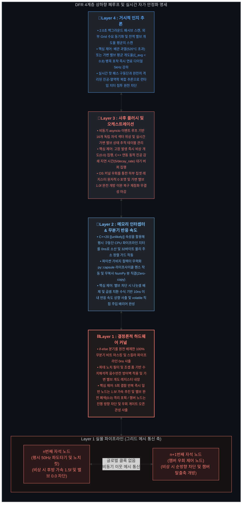

### 해당 저장소는 차세대 플라즈마 제어 시스템을 위한 **아이디어 스케치**입니다. HPC 기술과 하드웨어 융합 소프트웨어 아키텍처를 통합 검증하기 위한 **거시적 개념 실증(PoC) 및 브레인스토밍 저장소**라고 보시면 됩니다. SF소설 이라고 보셔도 무방할 정도로 아주 가벼운 저장소가 될 예정입니다

# Discrete Filament Router

### DFR 시스템은 기존 핵융합 방식인 토카막 방식의 3D 거대한 플라즈마 제어 한계를 거시적 1D 및 방향성 부여와 4개 레이어 하드웨어 융합 제어 루프를 통해 우회해보려 하는 아이디어입니다.

---

## 실시간 자가 안정화와 통합 제어를 위한 4단계 레이어

본 구조체의 실시간 자가 안정화와 통합 제어는 하부 실리콘 에지부터 최상위 추론 타워까지 4개 계층의 상하향식 폐루프 체인으로 실행됩니다.

### 🧠 Layer 4 (Cognitive Inference): 거시 인지 사령탑 (The Macro-Inference Brain)
*   **구조적 요약:** 플랜트 전역의 열역학 상태와 외부 전력망 수요를 패시브하게 관조하며 총출력을 조율하는 하향식 지능형 사령탑.
*   **제어 집행 (Output):** 배관 과열 또는 진공 흡입 컨덕턴스 병목 포착 즉시 연료 주입 주파수를 최소선(`HZ_MIN`)으로 강하하는 **'자가 안정화 영역(Homeostasis Lock)'** 실시간 집행.

### 👑 Layer 3 (Global Orchestration): 자율 복구 오케스트레이터 (The Self-Healing Heart)
*   **구조적 요약:** 하부 임베디드 레이어가 오프로드한 결함 토큰을 수신하여 전역 선로의 무결성을 자율 복구하는 비동기 소프트웨어 중추.
*   **제어 집행 (Output):** 결함 노드 감지 즉시 가상 전력망 마스크 격리 패스 적용 및 하부 칩셋 레지스터 영역을 원자적으로 직접 초기화하여 평시 기저선으로 복구.

### 🏰 Layer 2 (Hardware-Software Bridge): 초고속 데이터 도관 (The Zero-Copy Conduit)
*   **구조적 요약:** 최하단 실리콘 레지스터 물리 주소 공간과 상위 오케스트레이션 커널을 지연 시간 없이 상호 연결하는 순수 임베디드 데이터 관로.
*   **제어 집행 (Output):** 제로카피 0ns 사출 달성 및 밸브 차단 제어 시 나눗셈 연산을 배제하여 실질 진공 소산 속도를 10ns 이내로 무분기 사출.

### ⛓ Layer 1 (Hardware Silicon Edge): 결정론적 실리콘 에지 (The Real-Time Gate)
*   **구조적 요약:** 가속기 파이프라인 최전방에서 이산 플라즈마 패킷과 전력 반도체 인버터 코일단을 직접 통제하는 최하위 물리 실리콘 에지 레이어.
*   **제어 집행 (Output):** 수치 안정성 확보 및 결함 연속 누적 시 무분기 MUX를 작동시켜 진공 폭발 현상을 내부 완충 회랑 영역에 격리 포획.

---
👉 **각 레이어별 무분기 수식 매트릭스, C++ 베어메탈 드라이버 바인딩 주소 및 6중 샌드위치 아키텍처 상세 사양은 [기술 시스템 규격서 (docs/System_Specs.md)](docs/System_Specs.md)에서 아키텍처 실물 파일명과 함께 확인 가능합니다.**

## 📂 추가 명세 및 실전 배포 가이드라인 (Comprehensive Specifications)

* 📄 **하드웨어 사양 및 로우레벨 커널 인터페이스:** [`docs/System_Specs.md`](docs/System_Specs.md)
* 📄 **3D 토카막과 DFR 아키텍처 비교:** [`docs/system_comparison.md`](docs/system_comparison.md)
* 📄 **평시 정상 운전 및 구조체의 발전 방식:** [`docs/Normal_Operation_Specs.md`](docs/Normal_Operation_Specs.md)
* 📄 **비상 상황 대응 및 재가동 시퀀스:** [`docs/Emergency_Sequence.md`](docs/Emergency_Sequence.md)
* 📄 **GaN/SiC 반도체 주입용 고정 위상차 오프셋 행렬:** [`docs/dfr_phase_shift_matrix_spec.md`](docs/dfr_phase_shift_matrix_spec.md)
* 📄 **DFR 관련 물리노트:** [`docs/Physics_note.md`](docs/Physics_note.md)
