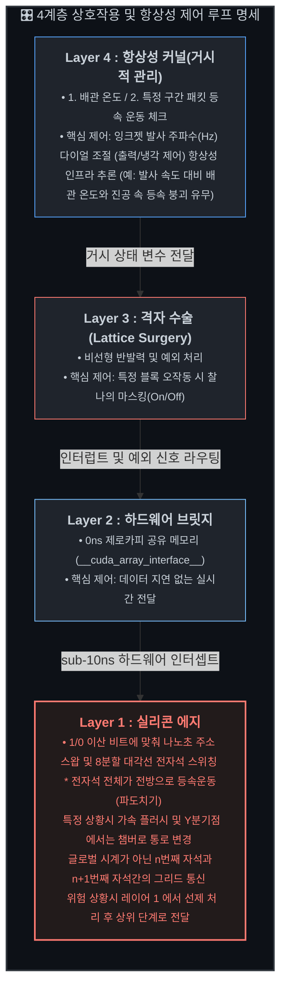

### 본 저장소는 차세대 선형 유체 및 플라즈마 제어 시스템을 위한 **아이디어 스케치**입니다. 고성능 컴퓨팅(HPC) 기술과 하드웨어 융합 소프트웨어 아키텍처를 통합 검증하기 위한 **거시적 개념 실증(PoC) 및 브레인스토밍 결과 저장소**라고 보시면 됩니다. SF소설 이라고 보셔도 무방할 정도로 아주 가벼운 저장소가 될 예정입니다

# Discrete Filament Router (DFR / FNG-V3)

DFR(FNG-V3) 시스템은 기존 3D 볼류메트릭 토카막의 거대한 비선형 플라즈마 제어 한계를 **1D 선형 궤적 매핑**과 **4개 레이어 하드웨어 융합 제어 루프**를 통해 우회해보려 하는 아이디어입니다.

---

## 🧠 Level 4 (Cognitive Inference & Structural Immunity): 거시 학습 및 상황별 패킷량 조절 타워 (Macro-Inference & Dynamic Injection Dial)
## `dfr_macro_cognitive_dial.py`

* **구조적 위치:** 실시간 연산 가속 파이프라인과 완벽히 격리되어, 전역 텔레메트리 데이터를 기반으로 장기적 안전성과 출력 효율을 조율하는 하향식 지능형 사령탑.
* **주요 역할:**
    * **[동적 연료량 변조]** 배관 평균 타겟 온도(500°C 내외)와 전력망(Grid) 수요 곡선을 거시적으로 분석하여, 입구 잉크젯 분사 주파수를 5 kHz ~ 15 kHz 사이로 다이어링 제어함으로써 발전소 출력을 부드럽게 조절.
    * **[예측 정비 학습]** 전 구간 자석 노드에서 비동기적으로 수집된 누적 결함 빈도를 기반으로 자가 진단을 수행하여 부품 수명 및 교체 주기를 사전 추론.

## 👑 Level 3 (Global Orchestration): 자율 소산 사후 검증 및 복구 사령탑 (Asynchronous Post-Flush Recov-Orchestrator)
## `dfr_post_flush_orchestrator.py`

* **구조적 위치:** 말단 실리콘 에지(L1)와 가속 브릿지(L2) 위에서 거시적인 예외 상태와 복구 시퀀스를 집행하는 비동기 소프트웨어 중추.
* **주요 역할:**
    * **[소산 시퀀스 최종 체크]** Layer 1의 분산 그리드가 스스로 집행한 -99.0f 가속 플러시 및 Y자 관성 사출이 정상 완료되었는지 native asyncio 논블로킹 인터럽트 폴링으로 추적 및 검증.
    * **[진공 복구 및 장치 리셋]** 불량 찌꺼기가 비상 챔버로 빠져나간 후 배관 진공도(10⁻⁵ Torr 대)를 최종 확정하고, 가속 록인된 말단 레지스터를 상온 평시 50Hz 정속 주행 상태로 중단 없이 소프트 리셋(Re-ignition) 집행.

## 🏰 Level 2 (Hardware-Software Bridge): 임베디드 가속 및 가속기 브릿지 (C++ Accelerator Bridge Conduit)
## `c_accelerator_bridge_conduit.cpp`

*   **구조적 위치:** 최하단 실리콘 말초계(L1)와 상위 오케스트라단(L3)을 지연 없이 연결하는 순수 임베디드 데이터 관로.
*   **주요 역할:** `__cuda_array_interface__` v3 규격을 이용해 PCIe BAR Shared Memory 영역에서 0ns 제로카피 포인터 가로채기를 집행하여 호스트-디바이스 간 딥카피 병목 원천 제거. 파이썬 가비지 컬렉터(GC)의 개입을 원천 차단하여 메모리 할당 제로 지터 실현.
*  C++20 `[[unlikely]]` 예외 가드를 품은 베어메탈 ➔ JAX/XLA 고속 포인터 바이패스 브릿지, `fluid-mesh-hpc` 참조.

## ⛓ Level 1 (Hardware Silicon Edge): 최하단 하드웨어 실리콘 말초계 (Sub-Nanosecond Silicon Edge)
## `unified_magnet_master_core.h`

*   **구조적 위치:** 실제 플라즈마 패킷과 대면하는 최하부 물리 실리콘 엣지 레이어 (GaN/SiC 전력 인버터 및 코일단 직결).
*   **주요 역할:** 
    *   **[무연산 고속 곱셈 치환]** 설계 단에서 부동소수점 하드웨어 나눗셈 블록을 완전히 숙청. 64요소 분산 RAM 역수 LUT 기반 고속 곱셈으로 변환하여, 주행 중인 이산 플라즈마 토막(패킷)을 위한 sub-10ns 하드와이어드 자성 선제 진행파 형성.
    *   **[위치 기반 이중 포트 제어]** 단일 소스 코드로 하드웨어 세라믹 핀(is_chamber_node) 설정에 따라 일반 선로와 챔버 우회로를 자동 식별하여, 평시 직진축(main_z_flux)과 비상 챔버축(chamber_curl_flux) 독립 드라이버 소자 한 세트 더 정밀 통제.
    *   **[150% 규격화 플러시 및 관성 사출]** 상류 노드 사망 토큰(-99.0f) 5회 연속 누적 시 비상 상태 록인. 일반 노드는 평시 50Hz 사인파를 끊고 1.5f 규격화 가속 추진파(Hz Max Up)로 후방 플러시 집행. 챔버와 기존 통로가 나뉘는 Y자 분기점 노드는 곡선 자력(기존 통로)을 ns단위로 0.0f로 전원 차단하며 패킷을 직선형 챔버 통로 내부로 관성 사출 및 소산.
*   FPGA/ASIC 논리 패브릭 직결 및 `__builtin_memcpy` 기반 무분기 MUX 실패 토큰 사출을 통한 지터를 최소화한 결정론적 항상성 마감.

## 📂 추가 명세 

* 📄 **하드웨어 사양 및 로우레벨 커널 인터페이스:** [`docs/System_Specs.md`](docs/System_Specs.md)
* 📄 **레거시 3D 토카막 대비 DFR 아키텍처 비교:** [`docs/system_comparison.md`](docs/system_comparison.md)
* 📄 **평시 정상 상태 운전 및 전자기적 중첩 규격:** [`docs/Normal_Operation_Specs.md`](docs/Normal_Operation_Specs.md)
* 📄 **비상 대응 및 3단계 동적 디지털 플러시 규격:** [`docs/Emergency_Sequence.md`](docs/Emergency_Sequence.md)
* 📄 **초심자의 물리 노트 계속 추가 및 수정예정:** [`docs/Physics_note.md`](docs/Physics_note.md)
