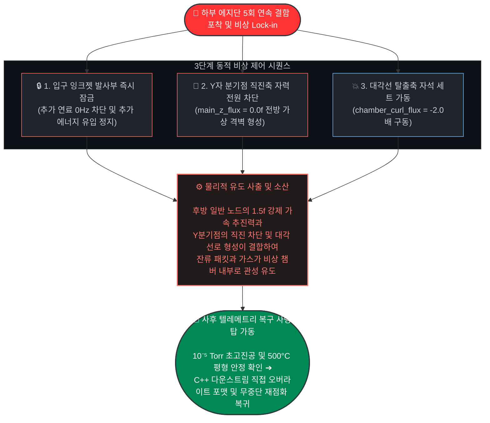

# 이산형 필라멘트 라우터 (DFR) - 비상 대응 및 동적 청정 시퀀스 규격서
# (Emergency Sequence & Digital Flush Protocol)

## 개요 (Overview)
본 문서는 폐쇄형 선형 가둠 구조체 내에서 상류 노드 단선, 국소적 열 평형 붕괴, 또는 플라즈마 궤도 이탈 등 크리티컬(Critical) 이상 징후가 감지되었을 때 에지 단에서 자율적으로 작동하는 '3단계 동적 디지털 플러시(Digital Flush) 시퀀스'의 물리적 집행 및 계층별 제어 인터록 규격을 정의합니다. 

본 프로토콜의 목적은 물리적 부품의 손상이나 기저 진공의 영구 파괴 없이, 고장 노드를 찰나의 순간 격리하고 장치를 실시간 무중단 리셋(Soft Reset)하여 365일 24시간 연속 가동성(High Availability)을 절대적으로 보장하는 데 있습니다.

*   **물리적 가둠 인프라 규격 (Physical Container Spec):** 단면 $\varnothing$ 60cm × 길이 100~200m 범위의 선형 원통형 루프 도관 구조체를 채택합니다.
*   **동역학적 진공 회랑 마진:** 평시 패킷 주행 시 중심축 기준 사방으로 $\ge$ 30cm의 UHV(초고진공) 완충 마진을 강제 확보하여, 비상 국면 돌입 시 불량 패킷이 물리적 제1벽에 충돌하기 전 연산 및 액추에이터가 구동할 수 있는 안전 시공간 버퍼를 제공합니다.
*   **비상 관성 유도 소산 메커니즘 (Emergency Egress Mechanism):** 결함 발생 시 단순 자력 소멸에 의한 방치나 기계적 흡입이 아닌, 하부 실리콘 커널의 하드와이어드 위상 변조를 통해 후방 노드의 1.5f 강제 가속 추진(Push)과 Y자 분기점 챔버 노드의 직진축 자력 완전 차단(0.0f 가상 격벽 형성) 및 대각선 탈출축 자석 세트의 구동을 동시 집행합니다. 이를 통해 패킷 자체의 진행 관성 유도 방향을 비상 소산 챔버 방향으로 조절해 잔류물들을 소산합니다.

---

## 1. 3단계 동적 비상 집행 시퀀스 (3-Step Dynamic Execution)

최하단 실리콘 에지(Level 1) 커널이 상류 노드 사망 토큰(-99.0f) 또는 부동소수점 예외(NaN/오버플로우)를 5회 연속 포착하여 비상 상태를 확정(Lock-in)하는 즉시, 시스템은 전 구간 상하위 레이어를 관통하는 다음 3단계 독립 시퀀스를 동시·결정론적으로 집행합니다.

### [1단계] 입력 차단: 입구 잉크젯 발사부 즉시 잠금 (Injection Intercept)
*   **물리적 메커니즘:** 센서 단선이나 라인 물리 파손으로 인해 상류 사망 토큰(-99.0f) 또는 IEEE 754 NaN/범위 초고온 오버플로우가 인입되는 순간, 최하위 실리콘 에지(Level 1) 커널 내부의 비분기 비트 덧셈기 연산 라인이 이를 즉각 검출해 냅니다.
*   **제어 집행:** 하부 칩셋이 연속 5회 결함 누적으로 비상 모드를 자율 확정(Lock-in)하면, 이 플래그가 Layer 2 C++ 브릿지의 무복사 0ns 고속도로를 타고 상위 오케스트레이터(Level 3)로 캐치됩니다. 거시 지능 사령탑(Level 4)은 이 전역 텔레메트리 스트림을 패시브 스캔하는 즉시, 입구 단 마이크로 노즐 어레이(잉크젯 구조체)의 분사 주파수를 즉각 **0Hz** 마스터 인터럽트로 다운 튜닝하여 추가 연료 패킷 유입을 완전히 동결하고 선로 내 추가 에너지 유입을 차단합니다.

### [2단계] 선로 격리: Y자 분기점 전방 가상 격벽 형성 및 탈출 선로 가동 (Magnetic Line Isolation)
*   **물리적 메커니즘:** 1D 선형 트랙 루프 내부의 잔류 유체 흐름 속에서 불량 패킷이 고장 섹터로 진입하지 못하도록 앞길을 물리적으로 격리 차단하고 우회 통로를 구축합니다.
*   **제어 집행:** 하드웨어 세라믹 핀 마킹 설정이 `is_chamber_node == 1`로 바인딩된 Y자 분기점 노드 칩셋들은 상위의 네트워크 명령 지연을 기다리지 않고, 비상 상태 록인 즉시 독립 이중 포트 드라이버를 교차 제어합니다. 평시 순방향 밀어주기를 수행하던 Z축 직진 자석 강도를 즉시 **`main_z_flux = 0.0f`**로 소멸시켜 전방 가상 격벽을 칩니다. 이와 동시에 비상 챔버 축 방향으로 매핑된 별도의 대각선 자석 코일 세트 포트를 평시 예측 위상 곡선의 -2배 세기인 **`chamber_curl_flux = -curl_pred * 2.0f`** 역방향 가전압으로 구동시킵니다. 기계적 밸브 구동 지연이 완전히 소멸된 sub-10ns 단위의 전자기적 궤도 변환 가이드라인이 형성됩니다.

### [3단계] 후방 플러시: 전 구간 일반 노드 강제 추진파 인젝션 (Deterministic Push-Flush)
*   **물리적 메커니즘:** 관 내부에 불규칙하게 남아 있는 잔류 불량 플라즈마 알갱이와 리튬 가스 찌꺼기가 한 자리에 정체되어 관을 녹여내지 않도록, 50Hz 평시 사인파 리듬에서 전방 가속 추진력으로 고정 인젝션합니다.
*   **제어 집행:** 하드웨어 핀 마킹이 일반 구역(`is_chamber_node == 0`)으로 묶인 모든 배면 자석 노드들은 비상 록인 즉시 평시 50Hz 사인파 위상차 토싱을 중단합니다. 대신 GaN/SiC 전력 반도체 스위칭 노드를 통해 직진축 자력을 기저 규격화 최대 가속 출력인 **`main_z_flux = 1.5f`** 고정값으로 강제 전환하여 후방 플러시 추진파(Push)를 밀어냅니다. 이 추진파에 의해 밀려난 선로 내 모든 물질은 분기점 노드가 열어놓은 대각선 자기장 가이드를 타고 비상 소산 챔버 내부의 액체 리튬 응축 경계면으로 유도됩니다.

---

## 2. 하드웨어/소프트웨어 계층별 역할 매핑

본 비상 프로토콜은 `System_Specs.md`에 정의된 4대 소프트웨어 레벨 및 물리 인프라 자원을 다음과 같이 매핑하여 집행합니다.

### 1. Level 4 (Macro Cognitive Inference & Load Following)
* **백그라운드 스캔**: 거시적 온도 및 압력 분포 데이터를 기반으로 **2.0초 주기**의 스캔을 실행합니다.
* **비상 알람 차단**: 크리티컬 비상 알람 수신 즉시 잉크젯 인젝터 구동 주파수를 **0Hz**로 변경하여 차단합니다.
* **통합 소산 제어**: 사후 배관 정비가 완료되면, **JIT 컴파일 지터가 최소화된 영역** 내에서 자율 소산 시스템을 통합 제어합니다.

### 2. Level 3 (Global Orchestration)
* **단선 토큰 감지**: 비동기 `asyncio` 이벤트 루프의 비블로킹 폴링을 통해 하부 실리콘 에지에서 출력된 절대 단선 토큰(`-99.0f`)을 감지합니다.
* **전압 강하 차단**: 토큰 감지 즉시 가상 격자 마스킹(`active_lattice_mask = False`)을 적용하여 전압 강하를 차단합니다.
* **C++ 브릿지 드라이버 결속**: 사후 진공도가 확정되면, 하부 레지스터 비상 플래그의 **Atomic 초기화**를 위한 C++ 브릿지 드라이버 결속을 수행합니다.

### 3. Level 2 (Hardware-Software Bridge)
* **CPU 파이프라인 최적화**: 평시 구동단의 CPU 파이프라인 지터를 최소화하기 위해 **C++20 `[[unlikely]]` 예외 가드**를 가동합니다.
* **메모리 생명주기 제어**: 파이썬 가비지 컬렉터(GC)의 임의적 메모리 해제를 방지하는 `py::capsule` 생명주기 제어를 적용합니다.
* **고속 데이터 패스**: 실리콘 물리 주소를 복사 오버헤드 없이 **NumPy 배열 뷰로 직결(Zero-copy)**하는 고속 데이터 패스를 유지합니다.

### 4. Level 1 (Hardware Silicon Edge Kernel)
* **비상 록인 전환**: 조건문이 없는 무분기 비트 마스킹 파이프라인(`uni_branchless_select`)을 통해 **5회 연속 결함 포착 시** 시스템을 즉시 비상 록인(Lock-in) 상태로 전환합니다.
* **수치해석적 발산 차단**: 파데 노치 필터 및 조셉 폼 방어벽 변수(`p00_shield`)로 수치해석적 발산을 차단합니다.
* **실시간 선제 제어**: 세라믹 핀 마킹 설정에 따라 **0ns 수준**의 실시간 신호 출력 타이밍으로 다음 제어를 선제 적용합니다.
  * **일반 노드**: `1.5f` 가속 제어
  * **챔버 노드**: 직진 차단(`0.0f`) 및 탈출축 자석 세트 `-2.0배` 역방향 구동

### 5. Physical Infrastructure (물리 인프라 궤도)
* **동역학적 진공 회랑**: **사방 ≥ 30cm**의 마진을 확보하여 불량 패킷이 배관 내벽에 충돌하기 전 배출에 필요한 시공간적 버퍼를 제공합니다.
* **고속 흡입 포트**: 징검다리 레이아웃(**10~20cm 물리적 여백**)에 매립된 고속 흡입 포트를 통해 고전하 헬륨 애시(Helium Ash) 불순물을 실시간으로 분리 및 추출합니다.
* **가스 환원**: 비상 소산 챔버 내부의 **GlidCop 냉각 경계면**에서 가스를 환원시킵니다.

---

## 3. 사후 청정 및 무중단 재점화(Re-ignition) 프로토콜

비상 유도 사출이 완료되면, 가속 록인(Lock-in) 모드로 동결된 하부 실리콘 단을 정상 궤도로 복귀시키기 위해 최상위 Level 3 및 Level 4 사령탑은 아래의 **4단계 복구 인터록(Interlock)**을 강제 집행합니다.

### Step 1: 텔레메트리 진공 확증 (Vacuum Post-Verify)
비상 챔버 분기를 마감한 후, Level 3 오케스트레이터가 배관 내 진공 흡입 포트의 기저 분압을 비동기 스캔합니다. 불량 잔류 가스의 완전 배기 여부와 초고진공 평형 상태를 최종 검증합니다.
*   **목표 규격:** $10^{-5}$ Torr 이하 (핵융합로 기준 초고진공)

### Step 2: 배관 열적 평형 회복 (Thermal Stabilization)
Level 4 인지 타워가 GlidCop 외벽 구리 레이어의 전역 온도 프로파일을 모니터링합니다. 국소적 열 스파이크(Heat Spike)를 해소하고 시스템 전체가 기저 상온 평형 상태로 복귀했음을 확정합니다.
*   **목표 온도:** 500°C 내외

### Step 3: 하향식 레지스터 원자적 포맷 (Downstream Register Overwrite)
진공과 온도가 모두 정상 범위 내로 확증되면, Level 3 오케스트레이터가 PCIe BAR 공유 메모리를 통해 C++ 하향식 관로(`trigger_hardware_reignition_conduit`)에 직접 접근합니다. 하부 실리콘 레지스터의 비상 플래그를 1클록 만에 초기화합니다.
*   **초기화 대상:** `fail_counter` 및 `is_emergency_on` 플래그
*   **제어 방식:** `0`으로 원자적(Atomic) 직접 덮어쓰기

### Step 4: 무중단 순방향 재점화 (Soft Re-ignition)
실리콘 레지스터 포맷과 동시에 전 구간의 일반 자석 노드는 가속 추진파(1.5f)를 중단하고, 고정 위상차 리듬의 주행 궤도로 재진입합니다. 이와 함께 Level 4 타워가 입구 단 잉크젯 분사 주파수를 소프트 릴리즈하여 무중단 연속 발전을 재개합니다.
*   **자석 노드 제어:** 이웃 노드 간 50Hz 사인파 파도타기 (글로벌 클록 없음)
*   **잉크젯 주파수 전환:** 0Hz → 평시 가동 대역 (5 kHz ~ 15 kHz)

---

## 4. 기대 효과
*   **정비 부담 감소 :** 물리적 1차벽의 마모나 파괴가 생기기 전 빠르게 차단하므로, 사고 발생 시 장치를 분해 제독하거나 부품을 교체하는 비용을 감소시킵니다.
*   **가동 시간 보장:** 비상 플러시 완료 후 메인 선로의 초고진공(UHV State) 청정도가 확인되는 즉시 잉크젯 발사부가 재가동되므로, 발전 플랜트의 가동률(Availability)을 기존 기술 대비 수월하게 유지하여 채산성을 달성합니다.

