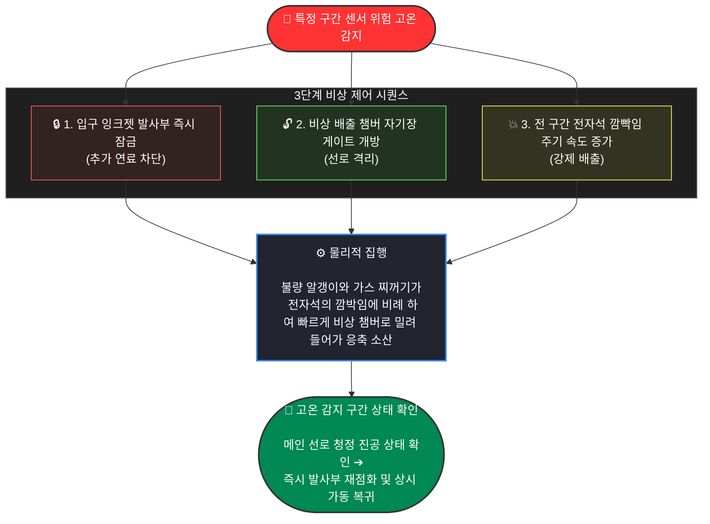

# 이산형 필라멘트 라우터 (DFR) - 비상 대응 및 동적 청정 시퀀스 규격서
# (Emergency Sequence & Digital Flush Protocol)

## 개요 (Overview)
본 문서는 폐쇄형 선형 가둠 구조체 내에서 국소적 고온 스파이크, 자석 결함, 또는 플라즈마 궤도 이탈 등 크리티컬(Critical) 이상 징후가 감지되었을 때 작동하는 '3단계 디지털 플러시(Digital Flush) 시퀀스'의 물리적 집행 및 계층별 제어 매커니즘을 정의합니다. 
본 프로토콜의 목적은 물리적 부품의 손상 및 진공 파괴 없이 장치를 실시간 리셋(Soft Reset)하여 365일 상시 가동이 가능 한지 체크하려 합니다.

---

## 1. 3단계 동적 비상 집행 시퀀스 (3-Step Dynamic Execution)

특정 구간의 센서 매트릭스에서 임계값(Threshold)을 초과하는 위험 고온이 감지되는 즉시, 시스템은 상하위 레이어를 관통하는 다음 3단계 독립 시퀀스를 동시·결정론적으로 집행합니다.

---

### 1.1 [1단계] 입력 차단: 입구 잉크젯 발사부 즉시 잠금 (Injection Intercept)
*   **물리적 메커니즘:** 센서 오버플로우 발생 즉시, 최하위 `Level 1 (Silicon Edge)`에서 하드웨어 레벨 결함 마커(`-99.0f`)를 부호 연산 라인에 직접 주입합니다.
*   **제어 집행:** `Level 4 (Homeostasis Kernel)`는 이 인터럽트를 수신하는 즉시 입구의 마이크로 노즐 어레이(잉크젯 구조체) 주입 주파수를 즉각 `0Hz`로 변조하여 추가 연료 패킷의 진입을 차단합니다. 그로인해 시스템 내 추가 에너지 유입이 멈춥니다.

### 1.2 [2단계] 선로 격리: 비상 배출 챔버 자기장 게이트 개방 (Magnetic Gate Egress)
*   **물리적 메커니즘:** 메인 1D 선형 트랙 루프와 격리된 별도의 비상 소산 챔버(Emergency Dissipation Chamber) 사이의 전자기적 장벽을 개방합니다.
*   **제어 집행:** `Level 3 (Global Orchestration)` 커널이 즉각 `active_lattice_mask`를 비상 모드로 스왑(Swap)합니다. 이를 통해 메인 선로를 유지하던 자기장 벡터를 대각선 비상 출구 방향으로 순간적으로 뒤틀어 버립니다. 기계적 밸브 구동 지연(Latency)이 없는 마이크로초($\mu$s) 단위의 전자기적 개방이 이루어집니다.

### 1.3 [3단계] 강제 배출: 전 구간 전자석 깜빡임 주기 최고 속도 폭발 (Hz Max Up)
*   **물리적 메커니즘:** 관 내부에 선형 전자기 진행파(Traveling Magnetic Wave)를 가속합니다(전자석의 깜박임을 빠르게 하여 등속운동에 가속도를 줍니다), 남아있는 불량 플라즈마 알갱이와 리튬 가스 찌꺼기를 평시보다 빠르게 전방으로 밀어내도록 유도합니다.
*   **제어 집행:** `Layer 1`의 GaN/SiC 전력 반도체 스위칭 주파수를 끌어올려 고속 디지털 펄스를 연속 주입합니다. 선로 내의 모든 불량 물질과 가스 찌꺼기가 비상 챔버 내부의 리튬 응축 플레이트로 밀려 들어가 소산됩니다.

---

## 2. 하드웨어/소프트웨어 계층별 역할 매핑

본 비상 프로토콜은 `System_Specs.md`에 정의된 4대 소프트웨어 레벨 및 3대 하드웨어 계층의 자원을 다음과 같이 매핑하여 집행합니다.

1.  **Level 4 (Homeostasis Kernel):** 거시적 온도/압력 분포 데이터를 기반으로 356일 상시 가동 템플릿을 유지하다가, 크리티컬 알람 수신 즉시 잉크젯 `0Hz` 셧다운 및 청정 진공 확인 후 즉시 재점화(Soft Reset) 명령을 총괄 제어합니다.
2.  **Level 3 (Global Orchestration):** 비동기 패시브 오케스트레이터의 비블로킹 폴링을 통해 결함 신호를 가로채고, 즉각 격자 수술(`active_lattice_mask` 비상 가상 그리드 스왑)을 실행하여 정상 선로와 오염 선로를 격리합니다.
3.  **Level 2 & 1 (Bridge & Silicon Edge):** 복사 대피 지연 지터(Jitter)를 무력화하기 위해 `__cuda_array_interface__` 규격 기반의 0ns 포인터 바이패스를 통해 결함 플래그를 상위로 초고속 토스하고, 나눗셈 블록이 제거된 하드와이어드 LUT 로직을 통해 대각 전자석에 가속을 위한 보정 펄스를 주입합니다.
4.  **Layer 1, 2, 3 (Physical Infrastructure):** 넓은 동역학적 진공 회랑($\ge$ 50cm 마진) 덕분에 불량 패킷이 배관 내벽에 닿기 전 배출 시간을 벌어주며, 비상 챔버로 밀려든 리튬 증기와 가스는 `Layer 2 (GlidCop)` 냉각 경계면에서 고속 상변화 응축되어 하부 포집 회로로 안전하게 환원됩니다.

---

## 3. 기대 효과
*   **정비 부담 감소 :** 물리적 1차벽의 마모나 파괴가 생기기 전 빠르게 차단하므로, 사고 발생 시 장치를 분해 제독하거나 부품을 교체하는 비용을 감소시킵니다.
*   **가동 시간 보장:** 비상 플러시 완료 후 메인 선로의 초고진공(UHV State) 청정도가 확인되는 즉시 잉크젯 발사부가 재가동되므로, 발전 플랜트의 가동률(Availability)을 기존 기술 대비 수월하게 유지하여 채산성을 달성합니다.
