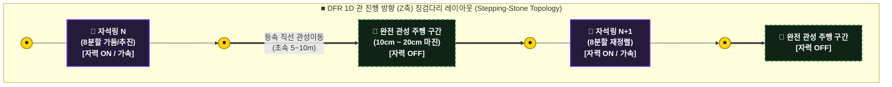
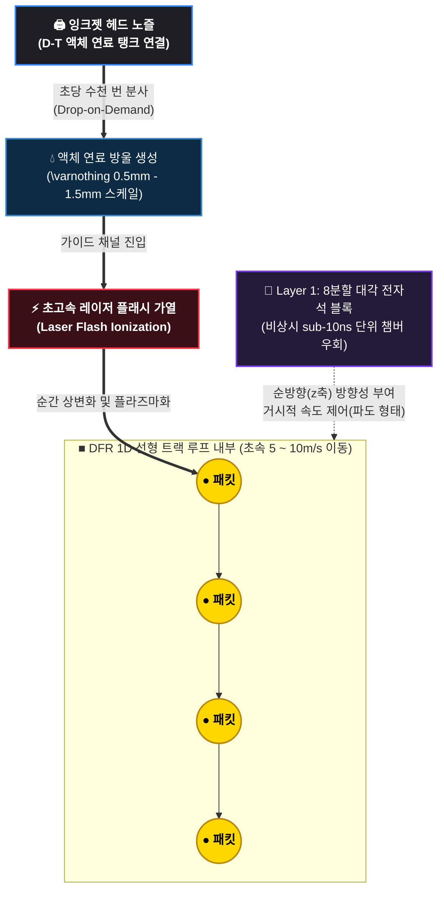

# 이산형 필라멘트 라우터 (DFR) - 평시 정상 상태 운전
# (Normal Operation Specs & Electromagnetic Overlay Protocol)

## 개요 (Overview)
본 문서는 `system_comparison.md`에 정의된 365일 24시간 정상 상태 스트림(Continuous Steady-State Stream)을 실현하기 위한 평시 전자기적 가둠 및 하드웨어 토폴로지 운전 규격을 정의합니다. 

본 시스템은 전방 대각선 방향으로 경사 배치된 8분할 전자석 블록의 '각도 마진(Angle Margin)'을 활용하여, 선형 구동 방식에 생길 수 있는 고질적 한계인 전자기적 정체 현상과 하드웨어 연산 병목(Bottleneck)을 물리적 기하학 구조로 피하는 것을 목적으로 합니다.

---

###  추론 결과 필요하다고 판단되어 추가합니다. (추후 수치 변경 가능성 있습니다.)

*   **[극초기 가동 전열 시퀀스]:** 극초기 기동 시 액체 리튬-납(Li-Pb) 공정 합금의 물리적 동결 폐색을 방지하고 완만한 기화를 유도하기 위해, Level 4 커널의 `trigger_system_warmup` 제어를 통해 배관 자체를 기저 전열 상태인 **250°C ~ 300°C**로 선제 웜업 가동.
*   **[진행파 기반 3차원 자화 가둠]:** 본 구조체의 전자기 제어 목적은 패킷을 강제 압착하는 것이 아닌, 연속 투입되는 플라즈마 패킷 고유의 횡방향 **자가 핀치(Self-Pinch) 압축력**과 자석 블록이 인젝션하는 Z축 이동 자기장의 **전방 추동력**을 교차 결합하는 것입니다. 이를 통해 플라즈마 패킷의 진행파 기반의 부드러운 1D 선형 주행.
*   **[자가 조절형 증기 차폐 쿠션]:** 앞선 패킷의 잔류 열기에 의해 자발적으로 형성된 리튬 기체 쉘(Shell)은 패킷이 외벽으로 이탈할수록 강해지는 증기 추력 장벽을 형성하며, 전자기적/열역학적 압착 쿠션 역할을 겸합니다.
*   **[맥동성 완전 관성 주행 구간]:** 자석링 사이에 배치된 **10cm ~ 20cm의 완전 관성 주행 구간**은 자가 핀치가 과압축되어 난류로 발산하는 것을 방지하는 수치해석적 맥동성(Pulsation Window)을 제공합니다. 패킷은 초속 5~10m의 속도로 약 20ms 동안 등속 직선 관성 비행을 수행한 뒤, 다음 자석링에 의해 재정렬됩니다.

---

## 1. 대각선 각도 마진을 통한 3대 하드웨어 병목 우회 메커니즘

### 1.1 전자기적 '부드러운 바톤 터치' (Magnetic Field Overlap)
기존의 선형 가속기나 수직 전자기 구동 방식은 자석들이 서로 수직(90°)으로 딱딱 끊어져 배치되기 할 시, 앞 칸 자석을 끄고 뒤 칸 자석을 켤 때 자기장이 꼬이거나 끊어지는 ‘전자기적 정체 현상’이 예상됩니다.
*   **연속적인 자력선 터널:** 본 시스템의 8분할 전자석 블록들은 전방 대각선 방향(예: $3^\circ \sim 5^\circ$ 경사 앙각)으로 자력선 벡터를 투사합니다. 이를 통해 각 블록이 만드는 자기장의 꼬리가 다음 블록의 가둠 영역과 물리적으로 부드럽게 중첩(Overlap)됩니다.
*   **지터 및 역기전력 제거:** 앞 블록의 자기장이 완전히 소실되기 전, 다음 블록의 대각선 벡터가 다가오는 플라즈마 패킷과 리튬 가스층을 미리 마중 나가듯이 자연스럽게 넘겨받습니다. 그 결과 계단식 스위칭에서 발생하는 전류 지터(Jitter)와 강력한 역기전력(Back-EMF) 병목이 근절되며, 패킷 흐름이 매끄러운 미끄럼틀을 타듯 연속적인 유체역학적 흐름(Continuous Flow)을 유지합니다.

### 1.2 제어 지연(Latency) 마진 확보: 시간적 위상차 윈도우 확장
만약 자석들이 상호 독립적인 글로벌 시계(Global Clock) 기반으로 구동되며 수직 배치될 경우, 마이크로 패킷의 실시간 주행 속도를 센싱하여 코일 정중앙 통과 시점에 서브-나노초 단위의 하드웨어 타이밍 오차 없이 개별 펄스를 실시간 계산(Dynamic Interlock)해 On/Off 해야 하므로, 에지단의 연산 부하와 동기화 지터가 극에 달하게 됩니다.

*   **공간-시간 위상 변환 매핑:** 본 시스템은 전역 중앙 집중식 타이밍 클록을 사용하지 않으며, n번째 자석과 n+1번째 자석이 이웃 간 비동기 그리드 메시(Mesh) 통신망을 통해 **50Hz 기저 파도타기 위상차(Phase Shift)**만을 토스하는 리듬 주행 방식을 채택합니다. 이때 대각선 경사각은 축 방향으로 연장된 자기장 중첩 영역(Overlap Zone)을 형성하여, 자력선 프로파일 자체의 공간적 마진을 확보합니다.
*   **그리드 동기화 부하 소산:** 패킷이 전방 운동 속도($5 \sim 10\,\text{m/s}$)로 이동하는 와중에 대각선 자력선이 다음 노드로 부드럽게 감겨 들어가므로, `Level 1 (Silicon Edge)` 커널과 `Layer 2 (C++ Accelerator Bridge)` 파이프라인은 실시간으로 가변 스위칭 타이밍을 계산할 필요가 없어집니다. 고정된 50Hz 사인파 리듬 안에서 이웃 노드 간 위상 동기화 클록을 유지하고 전자기적 맥동 신호를 안정적으로 토싱할 수 있는 결정론적 시간 윈도우(Time Window)가 마이크로초($\mu\text{s}$) 영역까지 대폭 완화되어, 스위칭 소자의 열화와 타이밍 지터를 원천 차단합니다.

### 1.3 역방향 전자기 누설(Cross-talk)의 기하학적 차단
수직 정렬된 고주파 선형 코일 시스템은 앞 칸의 초고속 전자기 펄스가 뒷 칸 코일에 기생 유도 전류를 발생시켜 `Layer 1` 고속 반도체 계층을 소손시키거나 정밀 제어 신호를 교란하는 크로스토크(Cross-talk) 병목에 취약합니다.
*   **방향성 기하학 필터 (Directional Geometric Filter):** 8분할 자석 블록들의 자력선 벡터가 철저히 전방 대각선 방향으로만 흐르도록 정렬되어 상류(Upstream)로의 전자기적 노이즈 및 에너지 역류 현상이 위상학적으로 차단됩니다.
*   **제어단 독립 격리:** 이 기하학적 격리 덕분에 인접한 다음 블록의 자석이 급격하게 켜지더라도 상류의 `Layer 1` 제어단은 어떠한 전자기적 상호 간섭을 받지 않으며, 분기 병목(Branch Bottleneck) 없는 독자적인 고속 연산 제어를 유지합니다.

---

## 2. 평시 정상 상태(Steady-state) 제어 루프 사양

본 가둠 장의 평시 유지 상태는 `System_Specs.md`에 명시된 소프트웨어 레이어와 다음과 같이 유기적으로 결합하여 항상성(Homeostasis)을 지속합니다.

1.  **Level 4 (Homeostasis Kernel)의 평시 다이얼링:** 배관 외벽 전체의 거시적 온도 프로파일을 모니터링하며, 자석 그리드의 진행파 파도타기 주기를 50Hz 고정 기저 주파수로 고정 가동합니다. 전력 수요 및 배관 열 평형 상태에 따라 입구 단의 잉크젯 분사 속도(주입 주파수, Hz)만 다이얼링 가변하여 파이프 내 패킷 간 주행 거리를 촘촘하거나 널널하게 거시적 자율 제어합니다.
2.  **Level 1 & Layer 2의 정적 위상 리듬 주행:** 자석 제어 시스템이 패킷의 통과 속도 변화에 맞춰 나노초 단위로 실시간 가변 펄스를 계산하거나 트리거할 필요가 없습니다. 최하단 실리콘 에지(Level 1) 커널과 가속기 브릿지(Layer 2) 파이프라인은 글로벌 시계 없이 n번째와 n+1번째 노드 간 **'고정 위상차 토싱(Fixed Phase-Shift Tossing) 기반 50Hz 사인파 파도타기'** 리듬으로만 운전되므로, 무리한 순간 전류 오버로드 및 타이밍 지터가 차단되어 GaN/SiC 전력 반도체 스위칭 소자의 물리적 수명 장기화를 보장합니다.

---

## 3. 종합 평시 운전 효과 (Operational Stability)
*   **하드웨어 스트레스 최소화:** 대각선 중첩 설계가 서브 나노초 제어의 정밀도를 만족하면서도 역기전력과 크로스토크를 소산시켜, 물리적 시스템 부품의 열화 및 하드웨어적 고장 확률을 원천적으로 떨어뜨립니다.
*   **이상적인 전열 매트릭스 구현:** 패킷이 전자기적 정체 없이 균일하고 부드러운 흐름을 유지하므로, 리튬 증기 거울의 자가 압축 효과와 외벽 구리층으로의 복사-전도 열교환이 국소적 열 스파이크 없이 완벽하게 균일한 대칭 상태(Macro Steady-state)를 유지하게 만듭니다.

---

## 4. 관 진행 방향(Z축) 자석 블록 징검다리 레이아웃 (Stepping-Stone Topology)

본 시스템은 연속적인 자석 배치를 배제하고, 자석링 사이에 물리적인 공백을 두는 징검다리형 위상학적 배치를 채택합니다. 이는 플라즈마 패킷이 가진 '관성이동(등속 직선 운동)' 특성을 극대화하여 하드웨어의 내구성을 극한으로 끌어올립니다.

### 4.1 징검다리 궤도 토폴로지 다이어그램 (Topology Diagram)

관 진행 방향(Z축)을 따라 자석링과 완전 관성 주행 구간이 다음과 같이 교대로 매핑됩니다.

---
### 4.2 징검다리 구조의 3대 물리적 이점 (Physical Advantages)

#### ① 전력 소모 및 전자기/열 피로도 제로화 (Zero Fatigue Zone)
*   **물리적 현상:** 플라즈마 패킷이 [자석링 N]을 통과하며 전방 대각선 추진력과 중심축 가둠 자력을 얻고 나면, 다음 [자석링 N+1]에 도달하기 전까지 **10cm ~ 20cm 구간 동안 어떠한 외부 힘도 받지 않는 상태**가 됩니다.
*   **엔지니어링 이점:** 뉴턴의 운동 제1법칙에 의해 패킷은 이 진공 구간을 **'관성에 의해 원래 속도(5~10m/s) 그대로 등속 직선 비행'**합니다. 이 구간을 지나는 동안 자석과 전원 반도체 소자(GaN/SiC)는 전력을 완전히 차단하고 쉴 수 있으므로, **코일의 열 축적과 전자기적 피로도가 0%**가 되어 장치 부하가 줄어듭니다.

#### ② 잉크젯 발사 속도(Hz) 조절을 통한 '단열 팽창-압축 안정화'
*   자석이 없는 진공 구간은 플라즈마 패킷이 미세하게 숨을 쉴 수 있는(미세 단열 팽창) 물리적 여유를 줍니다. 
*   패킷이 관성 주행 중 살짝 퍼지려고 할 때쯤, 다음 [자석링 N+1]이 대각선 전자기력으로 마중 나와 패킷을 다시 중심으로 꾹 짜주기 때문에(재압축), 플라즈마가 난류로 변하지 않고 **안정적인 맥동(Pulsation) 형태의 정상 상태**를 유지하며 굴러갈 수 있습니다.

#### ③ 진공 배기 및 유체(헬륨 Ash) 순환의 기하학적 통로 확보
*   자석 코일이 전 구간을 빽빽하게 감싸고 있으면 센서나 흡입 장치를 심을 물리적 공간이 전혀 나오지 않습니다. 징검다리 레이아웃이 확보해 준 **10cm ~ 20cm의 물리적 여백 공간**을 활용하여 Layer 2 (GlidCop) 내부의 초고속 열교환 파이프를 우회 배치하고, 진공 흡입 포트 및 헬륨 가스 분리 컬렉터, 그리고 배관 온도를 감시하는 센서를 매립할 수 있도록 해봅니다.

### 해당 마진 폭 10cm ~ 20cm는 예시입니다. 추후 수정이 필요합니다.(Physics_note.md 참조)
---

## 5 연료 투입 관련 소프트웨어 레벨 4(Level 4)와의 유기적 연결점 및 거시 관리 시나리오

거시적 사령탑 역할인 Level 4 는 2.0초 주기의 백그라운드 패시브 스캔을 통해 파이프라인의 물리적 상태를 감시하고 입구 단의 주입 밀도를 가변적으로 조절합니다.

*   **Level 4 텔레메트리 모니터링:** 배관 전체의 거시적 온도 프로파일이 설계 기저 상온 평형 목표치인 **500°C** 내외를 안정적으로 유지하고 있음을 감지합니다.
*   **거시적 제어 다이얼링:** 외부 전력망(Grid)의 수요 전력량 계수(Load Following) 상승에 맞추어, 제어 지터 및 JIT 컴파일 쇼크가 차단된 안전 펜스 내부에서 잉크젯 인젝터에 고 출력 고주파 발사 명령(**예: 15kHz**)을 투입합니다.
*   **물리적 결과:** 이산형 소형 플라즈마 구체(패킷)들이 1차원 선형 궤적 내에 촘촘한 간격으로 끊임없이 유입되며 복사열을 극대화합니다. 최하단 실리콘 에지(Level 1) 및 가속기 브릿지(Layer 2) 파이프라인은 글로벌 시계가 없는 이웃 노드 간 비동기 메시 통신망을 기반으로, 상위 단계와 상관없이 패킷의 속도를 초속 5~10미터의 흐름을 유지합니다. 그로 인해 플라즈마 패킷의 밀도가 높아져 구조체의 발전량이 증가합니다

