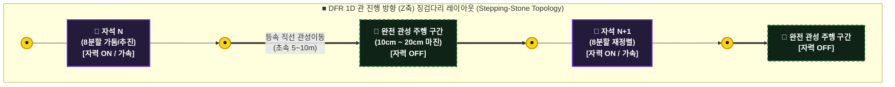
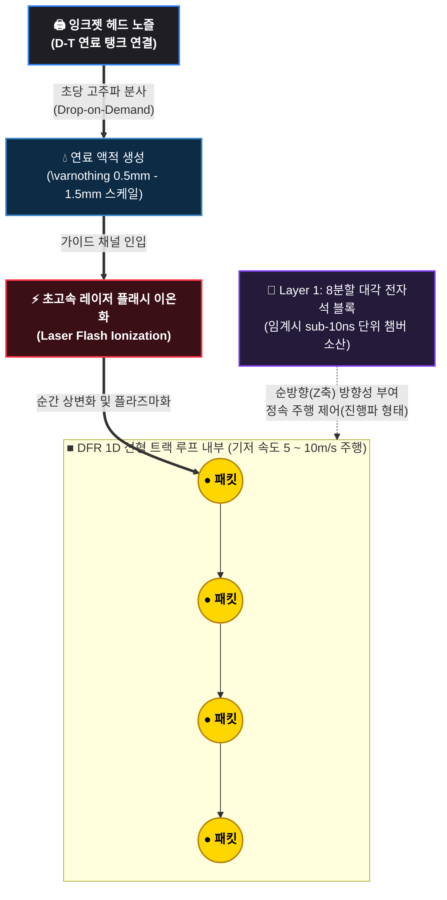

# 이산형 필라멘트 라우터 (DFR V3) - 평시 정상 상태 운전 사양서
# (Normal Operation Specs & Electromagnetic Overlay Protocol)

## 개요 (Overview)
본 문서는 `system_comparison.md`에 정의된 365일 24시간 정상 상태 스트림(Continuous Steady-State Stream)을 실현하기 위한 평시 전자기적 가둠 및 하드웨어 토폴로지 운전 규격을 정의함.

본 시스템은 전방 대각선 방향으로 경사 배치된 8분할 전자석 블록의 각도 마진(Angle Margin)을 활용하여, 선형 구동 방식의 전자기적 정체 현상과 하드웨어 연산 병목(Bottleneck)을 물리적 기하학 구조로 방어하는 것을 목적으로 함.

---

### 평시 예비 및 항상성 물리 가이드라인

*   **[극초기 가동 전열 시퀀스]:** 극초기 기동 시 유체 쿠션 장벽(Li-Pb 공정 합금)의 물리적 동결 폐색을 방지하고 기화를 유도하기 위해 Layer 4 항상성 커널의 `trigger_system_warmup` 제어를 통해 도관을 기저 전열 상태인 **250°C ~ 300°C**로 선제 웜업 가동함.
*   **[진행파 기반 3차원 자화 가둠]:** 전자기 제어의 목적은 패킷의 강제 압착이 아닌, 연속 투입되는 플라즈마 패킷 고유의 횡방향 **자가 핀치(Self-Pinch) 압축력**과 자석 블록이 인젝션하는 Z축 이동 자기장의 **전방 추동력**을 교차 결합하는 것임. 이를 통해 플라즈마 패킷의 진행파 기반 1D 선형 주행 안정성을 확보함.
*   **[자가 조절형 증기 차폐 쿠션]:** 선행 패킷의 잔류 열기에 의해 자발적으로 형성된 리튬 기체 물리 쉘(Shell)은 패킷이 물리적 제1벽으로 이탈할수록 강해지는 증기 추력 장벽을 형성하며, 전자기적/열역학적 압착 쿠션 역할을 겸함.
*   **[맥동성 완전 관성 주행 구간]:** 자석링 사이에 배치된 **10cm ~ 20cm의 완전 관성 주행 구간**은 자가 핀치가 과압축되어 난류로 발산하는 것을 방지하는 수치해석적 맥동성(Pulsation Window)을 제공함. 패킷은 초속 5~10m의 속도로 약 20ms 동안 등속 직선 관성 비행을 수행한 뒤, 다음 자석링에 의해 재정렬됨.

---

## 1. 대각선 각도 마진을 통한 3대 하드웨어 병목 우회 메커니즘

### 1.1 전자기적 오버랩 제어 (Magnetic Field Overlap)
기존 선형 가속기 및 수직 전자기 구동 방식은 자석 결착 각도가 수직(90°)으로 배치될 경우, 선행 블록 소멸 및 후행 블록 기동 시점에서 자기장 간섭 또는 단선에 의한 전자기적 정체 현상이 유발됨.
*   **연속적인 자력선 터널:** 본 시스템의 8분할 전자석 블록은 전방 대각선 방향(\(3^\circ \sim 5^\circ\) 경사 앙각)으로 자력선 벡터를 투사함. 이를 통해 개별 블록이 형성하는 자기장 후단이 다음 블록의 가둠 영역과 물리적으로 중첩(Overlap)됨.
*   **지터 및 역기전력 제거:** 선행 블록의 자기장 완전 소실 전, 후행 블록의 대각선 벡터가 유입되는 플라즈마 패킷과 절연 물리 쉘 영역에 선제 동기화됨. 그 결과 계단식 스위칭 기동 시 발생하는 전류 지터(Jitter)와 역기전력(Back-EMF) 병목이 차단되며, 패킷 흐름이 결정론적이고 연속적인 유체역학적 흐름(Continuous Flow)을 유지함.

### 1.2 제어 지연(Latency) 마진 확보: 시간적 위상차 윈도우 확장
상호 독립적인 전역 타이밍 클록(Global Clock) 기반으로 자석링이 구동 및 수직 배치될 경우, 마이크로 패킷의 실시간 주행 속도를 계측하여 코일 중심점 통과 시점에 맞춘 나노초(ns) 단위의 하드웨어 타이밍 오차 제어 제약(Dynamic Interlock)이 강제됨. 이는 에지단의 연산 부하와 동기화 지터를 발생시키는 병목 요인임.

*   **공간-시간 위상 변환 매핑:** 본 시스템은 전역 중앙 집중식 타이밍 클록을 전면 배제하며, n번째 노드와 n+1번째 노드가 이웃 간 비동기 그리드 메시(Mesh) 통신망을 통해 **50Hz 고정 위상차(Phase Shift)**만을 전달하는 정속 주행 방식을 채택함. 이때 대각선 경사각은 축 방향으로 연장된 자기장 중첩 영역(Overlap Zone)을 형성하여 자력선 프로파일 자체의 공간적 마진을 확보함.
*   **그리드 동기화 부하 소산:** 패킷이 전방 운동 속도(\(5 \sim 10\,\text{m/s}\))로 주행하는 제어 윈도우 내에서 대각선 자력선이 다음 노드로 동기화 결착되므로, Layer 1 하드웨어 커널과 Layer 2 C++ 데이터 관로 파이프라인은 실시간 가변 스위칭 타이밍을 동적 계산할 필요가 없음. 고정된 50Hz 사인파 리듬 안에서 이웃 노드 간 위상 동기화 클록을 유지하고 전자기적 맥동 신호를 안정적으로 토싱할 수 있는 결정론적 시간 윈도우(Time Window)가 마이크로초(\(\mu\text{s}\)) 영역까지 완화되어 스위칭 소자의 열화와 타이밍 지터를 원천 차단함.

### 1.3 역방향 전자기 누설(Cross-talk)의 기하학적 차단
수직 정렬된 고주파 선형 코일 시스템은 선행 블록의 고속 전자기 펄스가 후행 코일에 기생 유도 전류를 발생시켜 Layer 1 고속 반도체 레이어를 소손시키거나 정밀 제어 신호를 교란하는 크로스토크(Cross-talk) 병목에 취약함.
*   **방향성 기하학 필터 (Directional Geometric Filter):** 8분할 자석 블록의 자력선 벡터가 전방 대각선 방향으로만 인젝션되도록 정렬되어 상류(Upstream)로의 전자기적 노이즈 및 에너지 역류 현상이 위상학적으로 차단됨.
*   **제어단 독립 격리:** 이 기하학적 격리 매커니즘을 통해 인접 블록의 자석이 급격하게 구동되더라도 상류의 Layer 1 제어 커널은 전자기적 상호 간섭을 받지 않으며, 분기 병목(Branch Bottleneck) 없는 독자적인 고속 연산 제어를 유지함.

---

## 2. 평시 정상 상태(Steady-state) 제어 루프 사양

본 가둠 인프라의 평시 정상 상태는 `System_Specs.md`에 명시된 소프트웨어 제어 계층과 다음과 같이 연동하여 항상성(Homeostasis)을 지속함.

1.  **Layer 4 (Homeostasis Kernel) 거시 제어:** 물리 쉘 2(배관 외벽 전체)의 거시적 온도 프로파일을 모니터링하며, 자석링 어레이의 진행파 주기를 50Hz 고정 기저 주파수로 가동함. 외부 전력망 수요 및 전열 평형 상태를 판정하여 입구단 잉크젯 분사 주파수(Hz) 다이얼만을 결정론적으로 조절함으로써, 도관 내부 패킷 간 주행 공간 마진을 거시적 항상성 영역(Homeostasis Lock) 내에서 자율 제어함.
2.  **Layer 1 및 Layer 2 정적 위상 리듬 주행:** 자석 제어 시스템이 패킷의 통과 속도 변화에 맞추어 나노초(ns) 단위로 실시간 가변 펄스를 계산하거나 동적 트리거를 유도할 필요가 없음. 최하단 실리콘 에지(Layer 1) 커널과 가속기 데이터 관로(Layer 2) 파이프라인은 전역 마스터 클록 없이 n번째와 n+1번째 노드 간 **고정 위상차(Fixed Phase-Shift Tossing) 기반 50Hz 사인파 정속 주행** 리듬으로만 운전됨. 이를 통해 순간적 전류 오버로드 및 타이밍 지터가 원천 차단되어 물리 쉘 1 내에 내장된 GaN/SiC 전력 반도체 스위칭 소자의 장기 작동 수명을 보장함.

---

## 3. 종합 평시 운전 효과 (Operational Stability)
*   **하드웨어 스트레스 최소화:** 전방 대각선 오버랩 설계가 나노초(ns) 단위 제어 제약을 완화함과 동시에 역기전력 및 크로스토크를 소산시켜, 물리적 시스템 부품의 열화와 하드웨어 결함 유발 확률을 원천 차단함.
*   **이상적인 전열 매트릭스 구현:** 패킷이 전자기적 정체 현상 없이 균일한 정속 주행 상태를 유지하므로, 리튬 증기 장벽의 자가 압축 효과 및 물리 쉘 2(GlidCop 흡수 코어)로의 복사-전도 열교환이 국소적 열 스파이크(Heat Spike) 없이 균일한 거시 정상 상태(Macro Steady-state)를 유지함.

---

## 4. 관 진행 방향(Z축) 자석 블록 징검다리 레이아웃 (Stepping-Stone Topology)

본 시스템은 연속적인 자석 배치를 배제하고  8분할 대각 전자석 블록 사이에 물리적인 공백을 두는 징검다리형 위상학적 배치를 채택함. 이는 플라즈마 패킷이 가진 관성이동(등속 직선 운동) 특성을 극대화하여 하드웨어 내구성을 향상시킴.

### 4.1 징검다리 궤도 토폴로지 다이어그램 (Topology Diagram)

관 진행 방향(Z축)을 따라  8분할 대각 전자석 블록과 완전 관성 주행 구간이 교대로 매핑됨.

---
### 4.2 징검다리 구조의 3대 물리적 이점 (Physical Advantages)

#### ① 전력 소모 및 전자기/열 피로도 제로화 (Zero Fatigue Zone)
*   **물리적 현상:** 플라즈마 패킷이  8분할 대각 전자석 블록 N을 통과하며 전방 대각선 추진력과 중심축 가둠 자력을 확보한 후, 다음  8분할 대각 전자석 블록 N+1에 도달하기 전까지 10cm ~ 20cm 구간 동안 외력이 인가되지 않는 무전장 상태에 진입함.
*   **엔지니어링 이점:** 뉴턴의 운동 제1법칙에 의거하여 패킷은 해당 진공 회랑 구간을 기저 속도(5~10m/s) 그대로 등속 직선 관성 주행함. 이 구간 통과 시 자석 코일과 전력 반도체 레이어(GaN/SiC)는 인가 전력을 차단하므로 열 축적과 전자기적 피로도를 0% 수준으로 억제하여 시스템 열화 스트레스를 감쇄함.

#### ② 잉크젯 발사 속도(Hz) 조절을 통한 단열 팽창-압축 안정화
*   전자기장이 배제된 진공 완충 회랑 구간은 플라즈마 패킷의 미시 단열 팽창 여유 마진을 제공함.
*   패킷이 관성 주행 영역에서 확산 발산하기 전, 후행 자석링 N+1의 전방 대각선 전자기력 궤도 벡터에 포획되어 가둠 재압축이 실행됨. 이를 통해 플라즈마 유체의 난류 변환을 억제하고 안정적인 맥동(Pulsation) 형태의 정상 상태(Steady-state)를 유지함.

#### ③ 진공 배기 및 유체(헬륨 Ash) 순환의 기하학적 통로 확보
*   **엔지니어링 구조:** 징검다리 레이아웃을 통해 확보한 **10cm ~ 20cm의 물리적 여백 공간**을 활용하여 물리 쉘 2(GlidCop 중간 흡수층) 내부의 초고속 열교환 파이프를 우회 배치함. 이와 동시에 진공 흡입 포트, 헬륨 가스 분리 컬렉터 및 물리 쉘 2 내벽 온도를 측정하는 감시 센서 매립 공간을 확보함.

---

## 5. 연료 투입 관련 소프트웨어 Layer 4 와의 유기적 연결점 및 거시 관리 시나리오

최상위 거시 사령탑인 Layer 4 항상성 커널 타워는 2.0초 주기의 백그라운드 패시브 스캔을 통해 플랜트 전역의 물리적 상태를 감시하고 입구단의 주입 밀도를 가변 조절함.

*   **Layer 4 텔레메트리 모니터링:** 물리 쉘 2 전역의 거시적 온도 프로파일이 설계 기저 전열 평형선인 **500°C** 내외를 안정적으로 유지하고 있음을 판정함.
*   **거시적 제어 다이얼링:** 외부 전력망(Grid)의 수요 부하 추종(Load Following) 계수 상승에 맞추어 JIT 컴파일 지터가 차단된 안전 펜스 내부에서 잉크젯 인젝터에 고주파 발사 명령(최대 15 kHz 한계 주파수)을 투입함.
*   **물리적 결과:** 이산형 플라즈마 패킷이 1차원 선형 궤적 내에 촘촘한 간격으로 유입되어 복사열 플럭스를 극대화함. 최하단 실리콘 에지(Layer 1) 및 하드웨어 브릿지(Layer 2) 데이터 관로는 전역 마스터 클록이 없는 이웃 노드 간 비동기 메시 통신망을 기반으로 패킷의 속도를 기저 속도(5~10m/s) 상태로 유지함. 이에 따라 패킷 밀도가 상승하여 구조체의 최종 발전 총량이 증가함.

