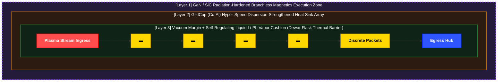

# 이산형 필라멘트 라우터 (DFR) - 기술 시스템 규격서

## 개요 및 물리적 가설 (Introduction & Physical Hypothesis)

본 시스템은 자연계의 구상번개(Ball Lightning) 현상을 **'화학적 분진 연소 에너지'와 '이를 외부에서 억누르는 전자기적 가둠 장'이 일시적인 평형 상태를 이루어 수 초간 구 형태를 유지하는 메커니즘**으로 해석하는 데서 출발합니다. 본 기술은 이 자연적 가둠 현상을 고주파 잉크젯 분사 방식과 결합하여, 인공적인 선형 구조체 내부에서 마이크로 단위로 통제 및 지속시키는 것을 목적으로 합니다.

폐쇄형 선형 가둠 구조체(Containment Structure) 내부에 장착된 마이크로 노즐 어레이(잉크젯 구조체)를 통해 극소량의 핵융합 연료를 초고주파로 연속 발사하고, 전방을 향해 대각을 이룬 전자기력을 가해 선형적 필라멘트 흐름의 방향성을 확보합니다.

이때 구조체 표면의 액체 리튬은 전방으로 등속운동하는 고에너지 플라즈마 필라멘트 패킷에 의해 열적으로 기화되며, 플라즈마 필라멘트를 입체적으로 감싸는 리튬 가스 형태의 절연 쉘(Shell)을 자가 형성합니다. 이후 외부의 부드러운 전자기력을 유기적으로 제어하여 이 리튬 가스 쉘의 가둠 상태를 지속적으로 미세 조정하는 초정밀 제어를 수행합니다.

본 시스템의 실질적인 메커니즘은 실제 핵연료를 화학적으로 연소시키는 것이 아닙니다. 고주파로 분사된 **플라즈마 패킷을 리튬 가스 쉘을 통해 열적으로 보온(Thermal Insulation)하고 전자기적으로 반사(Reflection)함으로써, 플라즈마 패킷 고유의 높은 에너지 상태와 지속성을 선형 루프 내에서 극대화하는 것을 목적**으로 합니다. 이를 통해 1억 도에 달하는 핵융합 고에너지 상태가 통제 불능의 폭발로 치닫는 대신, 선형 루프를 따라 형성된 필라멘트 궤적 내에서 "극도로 느리고 안정적인 정상 상태(Steady-state)"를 유지하도록 강제합니다.

---

## 1. 물리적 하드웨어 토폴로지 및 다층 구조 (위상학적 장 설계 및 다중 보호 방향성)

본 물리적 플랜트는 기존 토카막(Tokamak) 방식이 가진 방대한 3차원 체적 공간의 제어 한계를 극복하기 위해, 
플라즈마 가둠 영역을 **1차원 선형 궤적 루프(1D Linear Trajectory Loop)**로 매핑합니다. 

이 선형 가둠 구조체(Containment Structure)는 내부의 고에너지 플라즈마 필라멘트 경로를 물리적·전자기적으로 밀폐하는 다층 매트릭스(Multi-layered Matrix) 역할을 수행합니다. 
구조체 내벽은 액체 리튬 흐름층, 조건부 기화된 리튬 가스 절연막, 그리고 외곽의 전자기 유도 코일로 층상화되어 하드웨어 가둠 매트릭스의 물리적 규격을 세부화합니다. 

이는 결과적으로 시스템의 제어 차원을 대폭 축소함으로써, 제2장에 기술될 소프트웨어 코어가 실시간 변조 및 평형 제어에 균형을 잡을 수 있도록 합니다.

### 1.1 경계 구조적 치수 (Boundary Structural Dimensions)
* **코어 이송 채널 (Core Transit Channel):** 미세 다발화(Micro-bunching) 안정화에 최적화된 단일 튜브 형태의 폐쇄형 도관입니다.
* **유효 패킷 직경 (Effective Packet Diameter):** $\varnothing$ `0.5mm – 1.5mm` 스케일의 미세 필라멘트 패킷 다발입니다.
* **동역학적 진공 회랑 (Dynamic Vacuum Corridor):** 과도기적 운동 섭동을 완충하고 물리적인 제1벽(First-wall) 접촉을 원천 차단하기 위해 외곽으로 $\ge$ `30cm` 영역의 가둠 마진을 확보합니다.

### 1.2 다층 소재 계층 규격 (Multi-Tier Material Layer Specifications)
* **계층 3 (전방 운동 경계면 / Layer 3):** 텅스텐-구리 경사기능소재(W-Cu FGM) 위에 `3mm-5mm` 두께로 흐르는 **액체 리튬-납(Li-Pb) 박막**입니다. 국소적인 비선형 열 스파이크를 중화하기 위해 증발식 *증기 차폐(Vapor Shielding)* 쿠션을 자가 형성합니다.
* **계층 2 (열역학적 흡수 코어 / Layer 2):** 고밀도 **GlidCop (Cu-Al)** 히트싱크 튜브 어레이입니다. 목표 **60% - 70%의 하이브리드 에너지 회수 효율**을 바탕으로 복합 열 추출 그리드를 구동합니다.
- **계층 1 (주변부 전자기 집행존 / Layer 1):** 고속 **GaN/SiC 전력 반도체 스위칭 노드**를 탑재하여 밀폐 및 방사선 차폐된 독립 세그먼트입니다. 분기 없는 **HLS 인라인 하드와이어드(Branchless Bitmask MUX)** 실행 라인과 직접 결합하여, 상류 결함 포착 시 **10ns 미만(sub-10ns)**의 즉각적인 자기장 연산 보정 및 0ns 레지스터 와이어 사출을 수행합니다. (아키텍처 내 계층별 명령 판단 및 하드웨어 레지스터 덮어쓰기 오버헤드가 제로에 가깝다는 의미이며, 전력 인덕터 자체의 물리적 충전 시속을 뜻하는 것은 아닙니다.)

---

### 1.3 종합 6개 계층 물리적 경계 규격 (Comprehensive 6-Layer Physical Boundary Specifications)

연속적인 1차원 궤적 루프는 6중 샌드위치 아키텍처로 엔지니어링되었습니다. 이 설계는 가둠의 부담을 거대한 외부 자기장 제어에서 **자가 조절형 경계 구동식 열역학 및 유체역학적 균형 프레임워크**로 전환합니다.

| 계층 명칭 (Layer Name) | 밀도 / 마진 규격 (Density / Margin Spec) | 주요 소재 구성 (Primary Material Component) | 세부 물리 메커니즘 및 기능적 역할 (Detailed Physical Mechanics & Functional Role) |
| :--- | :--- | :--- | :--- |
| **최심부 코어 축** (Deepest Core Axis) | 직경: 1mm - 2mm  | D-T 플라즈마 트레인 (중수소-삼중수소) | 100M K 온도 상태에서 5–10 m/s의 속도로 느린 드리프트 궤적을 주행하며 1D 선형 정렬을 유지합니다. 폭발적인 부피 팽창 대신 **정전기적 표면 장력으로 제어되는 구상번개 기반의 이산형 패킷 연소 패러다임**을 적용합니다. 유체 쿠션 계층의 자가 반발력(증기 추력)과 전자기력을 활용하여 중심축의 플라즈마 밀도($n$)를 압축함으로써, '로슨 조건(Lawson Criterion)' 달성하려 합니다. |
| **진공 완충 지대** (Vacuum Buffer Zone) | 반경: 30cm 마진 (예시. 추후수정)  | 초고진공 상태 (UHV State) | 국소적인 플라즈마 킹크(Kink)나 고주파 미세 불안정성이 물리적 제1벽에 도달하기 전에 충분한 연산/액추에이터 제어 대기시간(Latency Buffer)을 확보합니다. 진공 블랭킷을 통해 전도 및 대류 열전달을 원천 차단함으로써, 1-2mm 코어 필라멘트를 단열하여 공간적 이송 거리와 무관하게 초고온의 코어 온도를 유지하려 합니다. (보온병 효과). |
| **계층 3 (제1벽 표면)** (Layer 3 / First-Wall Surface) | 60% - 65% 가변 기공율 격자 토폴로지 | 텅스텐-구리 경사기능소재 (W-Cu FGM) | 입사되는 고에너지 플라즈마 입자의 충격을 수직 충돌이 아닌 저각도의 대각 슬라이딩 벡터(전단 벡터)로 유도 및 분산합니다. 제1차 전자기 변위 지표를 인터셉트하는 비소모성 진단 메쉬 역할을 겸합니다. |
| **유체 쿠션 계층** (Fluid Cushion Layer) | 정상 상태 흐르는 박막 평균 두께: 3.0mm - 5.0mm | 액체 리튬-납 공정 합금 (Liquid Li-Pb Eutectic Alloy) | 고속 중성자를 포획하여 내부 연료인 삼중수소를 증식(Breeding)하는 동시에 자가 치유형 열 완충재 역할을 합니다. 국소적인 극단적 열유속이 발생할 경우, 리튬이 자발적으로 기화하여 **증기 차폐(Vapor Shielding) 단열 쿠션**을 형성합니다. 이 다각적 증기 프런트는 방사 에너지를 등방성으로 확산시키고, 플라즈마 패킷이 접근할수록 강해지는 자가 조절형 비선형 전자기/유체 역학적 반발 쿠션을 형성합니다.  $$\text{[연속 방사 흡수]} \rightarrow \text{[자발적 리튬 기화]} \rightarrow \text{[증기 차폐 쿠션 형성]} \rightarrow \text{[계층 2를 통한 응축]} \rightarrow \text{[유체 루프 재순환]}$$ |
| **계층 2 (중간 계층)** (Layer 2 / Intermediate Layer) | $\ge$ 95% 초고밀도 압출 도관 어레이 | 구리-알루미나 분산강화 합금 (GlidCop) | 열전도도를 극대화하여 고유속 열에너지를 즉각적으로 수확(히트싱크 작용)하고 이를 외부 가스터빈 발전 사이클로 직접 라우팅합니다. 기화된 리튬 분자가 GlidCop 냉각 경계면에 충돌하면 고속 상변화 응축을 일으켜 다시 액체 상태로 환원되며 하부 컬렉터로 낙하하여 **연속 리튬 포집 회로**를 완성합니다. |
| **계층 1 (주변부 배면층)** (Layer 1 / Peripheral Backing) | 95% - 99% 방사선 내성 밀폐 차폐 구조 | 세라믹 그리드 매트릭스 + **GaN/SiC 전력 반도체** | 저전력 내장 하드웨어를 위한 구역을 형성합니다. 하드웨어 논리 패브릭(HLS)으로 구현된 **인라인 분산 비트 마스킹(uni_branchless_select) 및 32바이트 Aligned 데이터 팩 구조**를 통해, 단 1클록의 타이밍 오차도 허용하지 않는 **단일 사이클의 결정론적 분기 없는 MUX 예측 자기 펄스 집행**을 수행하는 분산 제어 아키텍처를 내장합니다. |

---

#### Level 4 (Macro Cognitive Inference & Load Following): Homeostasis Kernel Tower
* **구조적 배치 (Structural Positioning):** 실시간 자석 주행 및 가속 파이프라인(Hot Path)과 물리적·시간적으로 완벽히 격리되어, 전역 텔레메트리 데이터를 기반으로 장기적 안전성과 출력 효율을 조율하는 하향식 지능형 사령탑입니다.
* **매크로 추론 및 부하 추종 (Macro Inference & Load Following):** 배관 평균 타겟 온도(500°C 내외)와 외부 전력망(Grid) 수요 곡선을 2.0초 주기로 거시적 패시브 스캔하여, 입구 잉크젯 분사 주파수 다이얼을 5 kHz ~ 15 kHz 사이로 결정론적으로 가변 조절함으로써 플랜트 전체 출력을 유기적으로 조율합니다.
* **지터 침투 차단 (Jitter Disruption Defense):** 무거운 거시 데이터 연산 및 상위 추론 로직을 2.0초 백그라운드 태스크로 완전히 분리함으로써, 파이썬 기동 및 연산 시 발생할 수 있는 미세 지터(Jitter)가 하부 실시간 구동단으로 전파되는 것을 원천 차단합니다.
* **자가 안정화 유도 (Self-Regulating Homeostasis):** 배관 내부의 과열 징후(520°C 초과 등)를 포착하는 즉시, 시스템 급정거 없이 연료 주입 주파수를 5 kHz 최저선으로 변조하여 정비 중단 없는 단위 면적당 열 부하 급감 및 자가 냉각 마진을 확보합니다.

#### Level 3 (Global Orchestration): Asynchronous Post-Flush Recov-Orchestrator
* **구조적 배치 (Structural Positioning):** 말단 실리콘 에지(Level 1)와 가속 브릿지(Level 2) 위에서 거시적인 예외 상태 제어와 배관 물리 복구 시퀀스를 집행하는 비동기 소프트웨어 중추입니다.
* **비동기 텔레메트리 폴링 (Asynchronous Telemetry Polling):** 네이티브 `asyncio` 비블로킹 이벤트 루프를 활용하여, 하부 실리콘 와이어가 독자적으로 사출한 절대 단선 및 사망 토큰(-99.0f)을 실시간으로 캐치하는 무병목 인터럽트 수동 리스닝 메커니즘을 구동합니다.
* **격자 수술 (Lattice Surgery):** 특정 섹터 고장 포착 즉시 가상 전력망 격자 활성 마스크(`active_lattice_mask`)를 즉각 `False`로 스왑하고 격리 궤도로 라우팅 동기화를 완수함으로써, 하나로 이어진 1D 선형 트랙 파이프 내의 전압 강하 및 그리드 위상 교란을 방지합니다.
* **사후 소산 및 초고진공 정비 (Post-Flush Recovery):** 불량 플라즈마 패킷과 잔류 찌꺼기가 비상 우회 챔버로 관성 사출되기를 비동기 대기한 후, 흡입 진공 펌프를 조율하여 기저 배관 진공도를 핵융합로 규격인 `10⁻⁵ Torr` 초고진공 및 500°C 평형 안정 상태로 강제 복구합니다.
* **하향식 물리 재점화 (Downstream Re-ignition Binding):** 16개 독립 자석 섹터의 실제 PCIe BAR / 공유 메모리 주소 매핑 테이블을 기반으로, Level 2 C++ 브릿지를 역방향으로 직접 가로채 하부 실리콘 레지스터 내부의 비상 록인 플래그와 `fail_counter`를 원자적(Atomic)으로 `0` 포맷팅하여 중단 없는 평시 50Hz 파도타기 주행 궤도 복귀를 완료합니다.

#### Level 2 (Hardware-Software Bridge): C++ Accelerator Bridge Conduit
* **구조적 배치 (Structural Positioning):** 최하위 하드웨어 실리콘 주변부(Level 1)와 상위 오케스트레이션 레이어(Level 3)를 통신 지연 시간 제로(0)로 연결하는 순수 임베디드 데이터 도관(Conduit)입니다.
* **0ns 제로카피 레지스터 가로채기 (Zero-Copy Register Interception):** Pybind11 캡슐 라이프사이클 펜스(`py::capsule`) 및 NumPy Direct Pointer View 공유 메커니즘을 이용해 PCIe BAR / 공유 메모리 영역의 실리콘 물리 주소를 메모리 딥카피 없이 32바이트 Aligned 마스터 구조체 레이아웃으로 즉각 재해석하여 인입 데이터 오버헤드를 0ns로 무력화합니다.
* **지터 제로 메모리 안전 펜스 (Zero-Jitter Lifecycle Protection):** 캡슐 내부 람다 소거자를 고의로 비워둠으로써 파이썬 가비지 컬렉터(GC)의 임의적인 하드웨어 레지스터 주소 반환 개입을 원천 차단하고, 메모리 할당 제로 지터(Zero-jitter) 베어메탈 수명을 보장합니다.
* **양방향 제어 고속 바이패스 (Bi-Directional High-Speed Bypass):** `fluid-mesh-hpc` 청사진 및 C++20 `[[unlikely]]` 예외 가드로 보호되는 상향식 텔레메트리 뷰뿐만 아니라, 상위의 복구 트리거 판단 시 하부 실리콘 레지스터의 비상 록인 플래그와 카운터를 원자적으로 포맷팅하는 하향식 직접 오버라이트 주입 채널(`trigger_hardware_reignition_conduit`)을 완성합니다.

#### Level 1 (Hardware Silicon Edge): Sub-Nanosecond Silicon Edge Kernel
* **구조적 배치 (Structural Positioning):** 스트리밍 플라즈마 패킷과 직접 인터페이스하며 GaN/SiC 전력 인버터 및 코일단에 직결된 최하위 물리 실리콘 에지 레이어입니다.
* **연산 제거 및 선제적 구동 (Arithmetic Elimination & Anticipatory Actuation):** 실리콘 설계 레벨에서 부동 소수점 하드웨어 나눗셈 블록을 완전히 숙청하고, 64요소 분산 RAM 역수 LUT 기반 고속 곱셈으로 변환하여 실시간 이산 플라즈마 세그먼트에 대한 sub-10ns 하드와이어드 자성 선제 진행파를 형성합니다.
* **실시간 노이즈 제거 및 수치 안정성 (DSP Filtering & Mathematical Safety Wall):** 파데 근사(Padé Notch Filter) 기법을 조건문 없는 순수 사칙연산 파이프라인으로 구현하여 50Hz 그리드 전력 노이즈를 실시간 감쇄하고, 장시간 필터 구동 시 소수점 연산 오차로 유발되는 발산을 막기 위해 언제나 양수 플러스를 보장하는 조셉 폼(Joseph Form) 공분산 방어벽 변수(`p00_shield`)를 내장합니다.
* **하드웨어 레벨 페일세이프 MUX (Hardware-Level Failsafe & Branchless MUX):** 상류 결함 토큰(`-99.0f`) 및 IEEE 754 NaN 조건, 백만 임계값 오버플로우를 무분기 연산으로 병렬 검사하여, 5회 연속 발생 시 비상 상태로 전체 록인합니다. `__builtin_memcpy` 기반 무분기 MUX(`uni_branchless_select`)를 통해 핀 마킹 설정에 따라 일반 노드 1.5f 가속 추진파 가동 혹은 챔버 노드 직진 차단 및 대각 소용돌이 흡입을 0ns 와이어 사출 타이밍으로 집행합니다.

