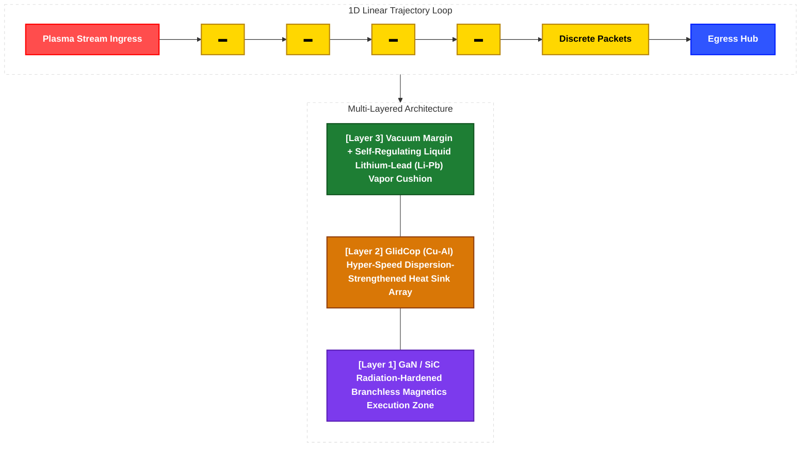

# Discrete Filament Router (DFR) - Technical System Specifications

This document defines the production-grade hardware dimensioning parameters and low-level software kernel execution interfaces for the **Discrete Filament Router (DFR / FNG-V3 Framework)**. 

---

## 1. Physical Hardware Topology & Multi-Layered Architecture (Topological Field Design & Multi-Tiered Protection Direction)

The physical plant maps a 3D volumetric space into a strict **1D Linear Trajectory Loop** to enable deterministic packet streaming and minimize boundary intervention chattering.

---
### 1.1 Boundary Structural Dimensions
* **Core Transit Channel:** Single-tube closed conduit optimized for micro-bunching stabilization.
* **Effective Packet Diameter:** $\varnothing$ `0.5mm – 1.5mm` micro-scale filament bundles.
* **Dynamic Vacuum Corridor:** $\ge$ `50cm` global containment margin to buffer transient kinetic perturbations without triggering structural first-wall contact.

### 1.2 Multi-Tier Material Layer Specifications
* **Layer 3 (Forward Kinetic Boundary):** W-Cu Functionally Graded Material (FGM) overlaid with a `3mm-5mm` flowing **Liquid Lithium-Lead (Li-Pb) film**. Spontaneously forms an evaporative *Vapor Shielding* cushion to neutralize non-linear local thermal spikes.
* **Layer 2 (Thermodynamic Ingestion Core):** High-density **GlidCop (Cu-Al)** heat sink tubing. Drives compound thermal extraction grids with a targeted **60% - 70% hybrid energy recovery efficiency**.
* **Layer 1 (Periphery Electromagnetic Execution Zone):** Hermetically isolated, radiation-hardened segment housing high-speed **GaN/SiC power semiconductor switching nodes**. Directly coupled to branchless **CUDA PTX** execution lines to drive immediate **sub-10ns** magnetic correction.

### 1.3 Comprehensive 6-Layer Physical Boundary Specifications

The continuous 1D trajectory loop is engineered through a 6-tier sandwich architecture. This design shifts the containment burden from massive external magnetic confinement to a self-regulating, boundary-driven thermodynamic and fluidic balancing framework.

| Layer Name | Density / Margin Spec | Primary Material Component | Detailed Physical Mechanics & Functional Role |
| :--- | :--- | :--- | :--- |
| **Deepest Core Axis** | Diameter: 1mm - 2mm (Scalable to 0.5mm - 1.5mm Ultra-Fine Filament) | D-T Plasma Train (Deuterium-Tritium) | Runs a slow drift trajectory at 5–10 m/s under 100M K, maintaining a strict 1D linear alignment. Replaces explosive bulk expansion with a **ball-lightning-inspired discrete packet combustion paradigm governed by electrostatic surface tension**. Exploits the spontaneous rebound repulsion (vapor thrust) of the fluid cushion layer to self-compress plasma density ($n$) on the central axis, achieving 'Lawson Criterion' parity without colossal external magnetics. |
| **Vacuum Buffer Zone** | Radius: 50cm Margin | Ultra-High Vacuum (UHV) State | Secures a significant compute/actuation latency buffer before localized plasma kinks or high-frequency micro-instabilities can bridge the gap to the physical first-wall. Eliminates conductive and convective heat transfer via the vacuum blanket, thermally insulating the 1-2mm core filament to sustain its ultra-high core temperature independent of spatial transit distances (Dewar flask effect). |
| **Layer 3 (First-Wall Surface)** | 60% - 65% Variable Porosity Lattice Topology | Tungsten-Copper Functionally Graded Material (W-Cu FGM) | Diverts incoming high-energy plasma particle impacts into low-angle diagonal sliding vectors (shearing vectors) rather than orthogonal collisions. Functions as a non-sacrificial diagnostic mesh to intercept 1st-tier electromagnetic shift metrics. |
| **Fluid Cushion Layer** | Mean Thickness: 3.0mm - 5.0mm Steady-State Flowing Film | Liquid Lithium-Lead (Li-Pb) Eutectic Alloy | Captures fast neutrons to achieve internal fuel tritium breeding while providing a self-healing thermal buffer. Under localized extreme heat flux, the lithium spontaneously vaporizes to trigger a **Vapor Shielding thermal insulation cushion**. This multi-modal vapor front diffuses radiative energy isotropically and exerts a self-regulating, non-linear electromagnetic/fluidic repelling cushion that intensifies as the plasma packet approaches.  $$\text{[Continuous Radiation Ingestion]} \rightarrow \text{[Spontaneous Li Evaporation]} \rightarrow \text{[Vapor Shielding Cushion Formation]} \rightarrow \text{[Condensation via Layer 2]} \rightarrow \text{[Fluidic Loop Recirculation]}$$ |
| **Layer 2 (Intermediate Layer)** | $\ge$ 95% Ultra-High Density Extruded Conduit Array | Copper-Alumina Dispersion-Strengthened Alloy (GlidCop) | Maximizes thermal conductivity to instantly harvest high-flux thermal energy (Heat Sink Action) and routes it directly to external gas turbine generation cycles. When vaporized lithium molecules encounter the GlidCop cooling boundary, they undergo high-velocity phase condensation, turning back into liquid form and falling into the lower collector to complete the **Continuous Lithium Capture Circuit**. |
| **Layer 1 (Peripheral Backing)** | 95% - 99% Radiation-Hardened Hermetic Shielding | Ceramic Grid Matrix + **GaN/SiC Power Semiconductors** | Forms a pristine, zero-neutron-leakage zone for low-level embedded hardware. Houses the distributed processing architecture to execute **single-cycle deterministic, branchless MUX anticipatory magnetic pulse execution** via hardwired CUDA PTX instruction blocks. |

---

## 2. Low-Level Software Core & 0ns Ingress Kernel (Fluid-Mesh Fused — Legacy Repository Derivative Alignment & Strategic Direction)

The software engine enforces absolute decoupling between macro-scale probabilistic tracking and sub-10ns bare-metal physical stabilization. Mapped natively to a **4-Tier Hardware-Fused Control Loop Topology**, the infrastructure completely isolates high-latency software layers from the active fluidic coherence window, anchoring execution boundaries inside strict deterministic constraints.

### 2.1 `interface/dlpack_bridge.py` (Borrowed from Fluid-Mesh-HPC v4) — Level 2 to Level 3 Zero-Copy Pointer Bypass
* **Inter-Framework Direct Pass:** Hooks directly into the raw memory address space allocation table via `__cuda_array_interface__ v3` protocols over **PCIe Unified/BAR Shared Memory space**. By passing raw physical base pointers to the JAX execution registry, it eliminates host-to-device deep-copy loops, pinning data transport overhead at exactly **0ns**.
* **Asynchronous Fencing Gates:** Introduces C++20 `[[unlikely]]` attribute check gates to route raw address exception tracks into cold binary segments, securing zero CPU pipeline stall overhead. It permanently binds tensor buffer lifecycles to insulate the active streaming pipeline from Python Garbage Collector (GC) chattering and asynchronous jitter spikes.

### 2.2 `kernel/physics_filter.py` (Borrowed from fluid-mesh-hpc v4) — Level 2 AI Core Backend Alwaysstasis Engine
* **Mathematical Backbone:** Fuses the **Neumann-Burgers' Viscous Dissipation** partial differential equations and Schrödinger potential energy barrier constraints natively into XLA registers during ahead-of-time (**AOT**) compilation.
* **Function:** Intercepts high-curvature ($\kappa$) structural anomalies and statistical hallucinations emitted downstream by the **Level 4 Sub-Brain (Generative LLM)**. It forces divergent hydrodynamic noise to safely dissipate as non-destructive algebraic thermal friction into the liquid lithium boundary layer before parameter cross-contamination occurs.
* **Branchless Real-Time Constraints:** Replaces conditional jump (`JMP`) instructions with flat hardware selection operations (`jax.lax.select` / `jnp.where`). Fused at a strict absolute threshold synchronization line of **1e6**, it mathematically freezes the backpropagation chain via localized `stop_gradient` encapsulation to secure a **1 hardware clock cycle** execution footprint.

### 2.3 `kernel/autograd_free.py` (Borrowed from fluid-mesh-hpc v4) — Level 2 Forward-Only O(1) VRAM Memory Allocator
* **Space Complexity Lockdown:** Enforces a rigid, unidirectional memory allocation barrier at the ingestion layer, permanently purging the backward differentiation graph from active VRAM sectors during running operations.
* **Zero-Allocation In-Place Overrides:** Enforces explicit `donate_argnums` compilation flags at the outermost compiler tier. This directly overrides existing memory cell addresses at the hardware layer, ensuring the spatial VRAM footprint remains frozen at **$O(1)$ space complexity** across long-duration 365-day continuous production runs.

### 2.4 `fluid_mesh_baremetal_core.h` (Borrowed from fluid-mesh-hpc v4) — Level 1 Nanosecond Silicon Edge Processor
* **Execution Boundary:** Hardwired directly into FPGA/ASIC logic fabrics to enforce a strict **sub-10ns deterministic runtime boundary** at the solid-silicon hardware edge.
* **Arithmetic Innovation:** Completely purges heavy floating-point hardware division blocks from the operational instruction cache hot path. It fuses a compact **64-element distributed RAM Reciprocal LUT matrix** to drive instant, single-cycle DSP multiplication across 32-byte cacheline fields (`fluid_density_phi` and `velocity_theta`).
* **Hardware Fault Isolation:** Upon capturing a localized structural fracture exceeding **1e6f**, it deploys an ISO C-standard compliant `__builtin_memcpy` bitwise wire allocation to instantly inject a branchless hardware failure marker (**`-99.0f`**) into the register stream over a zero-overhead combinational MUX fabric, signaling Level 3 for immediate asynchronous axis amputation surgery.

