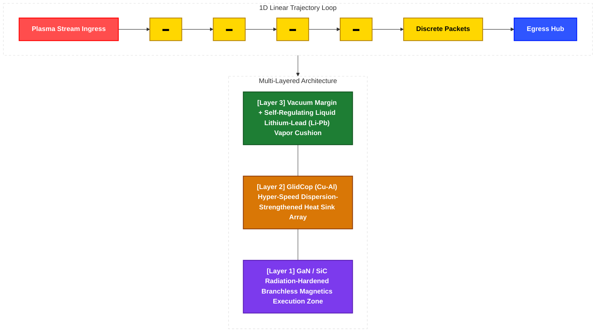

# Discrete Filament Router (DFR) - Technical System Specifications

What if we viewed ball lightning as a process of extremely slow dust explosion? And what if we applied that concept to plasma filament packets?

What if we attempted ultra-precise control by injecting fusion fuel (in the form of dust-like particles) into a network of thin, vessel-like structures, creating an insulating shell of lithium gas, continuously adjusting the shell's containment using gentle electromagnetic forces, and—instead of allowing the 100-million-degree combustion reaction to escalate into an explosion—forcing it to "burn extremely slowly"?

---

## 1. Physical Hardware Topology & Multi-Layered Architecture (Topological Field Design & Multi-Tiered Protection Direction)

The physical plant maps a 3D volumetric space into a strict 1D Linear Trajectory Loop to detail the structural specifications of the hardware containment matrix and establish a balancing framework for Section 2's software core.

---
### 1.1 Boundary Structural Dimensions
* **Core Transit Channel:** Single-tube closed conduit optimized for micro-bunching stabilization.
* **Effective Packet Diameter:** $\varnothing$ `0.5mm – 1.5mm` micro-scale filament bundles.
* **Dynamic Vacuum Corridor:** $\ge$ `50cm` global containment margin to buffer transient kinetic perturbations without triggering structural first-wall contact.

### 1.2 Multi-Tier Material Layer Specifications
* **Layer 3 (Forward Kinetic Boundary):** W-Cu Functionally Graded Material (FGM) overlaid with a `3mm-5mm` flowing **Liquid Lithium-Lead (Li-Pb) film**. Spontaneously forms an evaporative *Vapor Shielding* cushion to neutralize non-linear local thermal spikes.
* **Layer 2 (Thermodynamic Ingestion Core):** High-density **GlidCop (Cu-Al)** heat sink tubing. Drives compound thermal extraction grids with a targeted **60% - 70% hybrid energy recovery efficiency**.
* **Layer 1 (Periphery Electromagnetic Execution Zone):** Hermetically isolated, radiation-hardened segment housing high-speed **GaN/SiC power semiconductor switching nodes**. Directly coupled to branchless **CUDA PTX** execution lines to drive immediate **sub-10ns** magnetic correction.

### 1.3 Comprehensive 6-Layer Physical Boundary Specifications

The continuous 1D trajectory loop is engineered through a 6-tier sandwich architecture. This design shifts the containment burden from massive external magnetic confinement to a self-regulating, boundary-driven thermodynamic and fluidic balancing framework.

| Layer Name | Density / Margin Spec | Primary Material Component | Detailed Physical Mechanics & Functional Role |
| :--- | :--- | :--- | :--- |
| **Deepest Core Axis** | Diameter: 1mm - 2mm (Scalable to 0.5mm - 1.5mm Ultra-Fine Filament) | D-T Plasma Train (Deuterium-Tritium) | Runs a slow drift trajectory at 5–10 m/s under 100M K, maintaining a strict 1D linear alignment. Replaces explosive bulk expansion with a **ball-lightning-inspired discrete packet combustion paradigm governed by electrostatic surface tension**. Exploits the spontaneous rebound repulsion (vapor thrust) of the fluid cushion layer to self-compress plasma density ($n$) on the central axis, achieving 'Lawson Criterion' parity without colossal external magnetics. |
| **Vacuum Buffer Zone** | Radius: 50cm Margin | Ultra-High Vacuum (UHV) State | Secures a significant compute/actuation latency buffer before localized plasma kinks or high-frequency micro-instabilities can bridge the gap to the physical first-wall. Eliminates conductive and convective heat transfer via the vacuum blanket, thermally insulating the 1-2mm core filament to sustain its ultra-high core temperature independent of spatial transit distances (Dewar flask effect). |
| **Layer 3 (First-Wall Surface)** | 60% - 65% Variable Porosity Lattice Topology | Tungsten-Copper Functionally Graded Material (W-Cu FGM) | Diverts incoming high-energy plasma particle impacts into low-angle diagonal sliding vectors (shearing vectors) rather than orthogonal collisions. Functions as a non-sacrificial diagnostic mesh to intercept 1st-tier electromagnetic shift metrics. |
| **Fluid Cushion Layer** | Mean Thickness: 3.0mm - 5.0mm Steady-State Flowing Film | Liquid Lithium-Lead (Li-Pb) Eutectic Alloy | Captures fast neutrons to achieve internal fuel tritium breeding while providing a self-healing thermal buffer. Under localized extreme heat flux, the lithium spontaneously vaporizes to trigger a **Vapor Shielding thermal insulation cushion**. This multi-modal vapor front diffuses radiative energy isotropically and exerts a self-regulating, non-linear electromagnetic/fluidic repelling cushion that intensifies as the plasma packet approaches.  $$\text{[Continuous Radiation Ingestion]} \rightarrow \text{[Spontaneous Li Evaporation]} \rightarrow \text{[Vapor Shielding Cushion Formation]} \rightarrow \text{[Condensation via Layer 2]} \rightarrow \text{[Fluidic Loop Recirculation]}$$ |
| **Layer 2 (Intermediate Layer)** | $\ge$ 95% Ultra-High Density Extruded Conduit Array | Copper-Alumina Dispersion-Strengthened Alloy (GlidCop) | Maximizes thermal conductivity to instantly harvest high-flux thermal energy (Heat Sink Action) and routes it directly to external gas turbine generation cycles. When vaporized lithium molecules encounter the GlidCop cooling boundary, they undergo high-velocity phase condensation, turning back into liquid form and falling into the lower collector to complete the **Continuous Lithium Capture Circuit**. |
| **Layer 1 (Peripheral Backing)** | 95% - 99% Radiation-Hardened Hermetic Shielding | Ceramic Grid Matrix + **GaN/SiC Power Semiconductors** | Forms a pristine, zero-neutron-leakage zone for low-level embedded hardware. Houses the distributed processing architecture to execute **single-cycle deterministic, branchless MUX anticipatory magnetic pulse execution** via hardwired CUDA PTX instruction blocks. |

---

### 2. Multi-Layered Software 

###  Level 4 (Cognitive Inference & Structural Immunity): Generative LLM & Homeostasis Kernel
* **Structural Positioning:** A macro command tower that integrates and manages multiple independent sub-silicon/orchestration cells at a global level, mathematically dissipating AI divergence.
* **Macro Inference:** Infers macro-level systemic states based on pipeline-wide traffic data to generate guidelines and templates for spatiotemporal discrete packet trajectory driving.
* **Immunity Purification:** Neutralizes statistical discontinuities (numerical hallucinations) and NaN jumps in LLMs by forcing them through Neumann-Burgers and Schrödinger barrier equations.
* **Memory Optimization:** Freezes the spatial complexity of the immunity module to $VRAM\ O(1)$ using `stop_gradient`.
* **Hybrid Coupling:** Combines a special-purpose LLM (excluded from this repository) with an upper-level homeostasis filter kernel (only the kernel component is implemented here) via the `homeostasis-kernel` reference.

###  Level 3 (Global Orchestration): Asynchronous Passive Orchestrator
* **Structural Positioning:** An asynchronous software backbone that governs telemetry interrupts within a single control cell.
* **Telemetry Monitoring:** Utilizes native `asyncio` non-blocking passive interrupt polling to detect fault signals propagating from peripheral rails.
* **Lattice Surgery:** Executes immediate `active_lattice_mask` swaps and rerouting strategies to isolate faulty axes via virtual grid operations.
* **Concurrency Efficiency:** Ensures uninterrupted, non-blocking event routing free from GIL (Global Interpreter Lock) constraints.
* **Feedback Bridge:** Operates a continuous feedback loop and context-bridging mechanism back to the LLM layers.

###  Level 2 (Hardware-Software Bridge): C++ Accelerator Bridge Conduit
* **Structural Positioning:** A pure embedded data conduit linking the lowest hardware silicon periphery (Level 1) to the higher orchestration layer (Level 3) with zero communication latency.
* **Zero-Copy Interception:** Leverages the `__cuda_array_interface__` v3 specification to execute 0ns zero-copy pointer interception directly in the PCIe BAR Shared Memory region.
* **Bottleneck Elimination:** Eradicates Host-to-Device deep-copy bottlenecks and bypasses Python Garbage Collector (GC) intervention to achieve zero-jitter memory allocation.
* **High-Speed Bypass:** Implements a bare-metal to JAX/XLA high-speed pointer bypass bridge protected by C++20 `[[unlikely]]` exception guards, following the `fluid-mesh-hpc` blueprint.

###  Level 1 (Hardware Silicon Edge): Sub-Nanosecond Silicon Edge
* **Structural Positioning:** The lowest physical silicon edge layer that directly interfaces with streaming plasma packets.
* **Arithmetic Elimination:** Completely removes floating-point hardware division blocks from the silicon design level.
* **Anticipatory Actuation:** Utilizes a 64-element distributed RAM reciprocal Look-Up Table (LUT) for high-speed multiplication, executing sub-10ns hardwired anticipatory magnetic pulse injections for real-time discrete plasma segments.
* **Hardware-Level Failsafe:** Injects a permanent hardware-level fault marker (`-99.0f`) directly into register wires at the bit level the moment local sensor overflow exceeds the `1e6f` threshold.
* **Fabric Integration:** Direct-wires into FPGA/ASIC logic fabrics to eject branchless MUX failure tokens driven by `__builtin_memcpy`.

