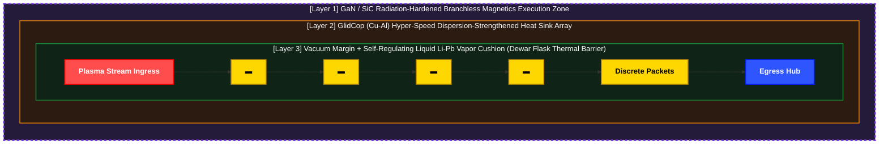

# 이산형 필라멘트 라우터 (DFR) - 기술 시스템 규격서

## 개요 및 물리적 가설 (Introduction & Physical Hypothesis)

본 시스템은 자연계의 구상번개(Ball Lightning) 현상을 **'화학적 분진 연소 에너지'와 '외부 전자기적 가둠 장'이 일시적인 평형 상태를 이루어 구 형태를 유지하는 메커니즘**으로 해석하는 데서 출발함. 본 기술은 이 가둠 현상을 고주파 잉크젯 분사 방식과 결합하여, 인공 선형 구조체 내부에서 마이크로 단위로 통제 및 지속시키는 것을 목적으로 함.

폐쇄형 선형 가둠 구조체(Containment Structure) 내부에 장착된 마이크로 노즐 어레이를 통해 극소량의 연료를 초고주파로 연속 발사하고, 전방 대각선 전자기력을 가해 선형 필라멘트 흐름의 방향성을 확보함.

이때 구조체 내부의 유체 쿠션 장벽(Fluid Cushion)은 전방으로 등속 이동하는 고에너지 플라즈마 패킷에 의해 열적으로 기화되며, 플라즈마를 감싸는 리튬 가스 형태의 절연 물리 쉘(Shell)을 자가 형성함. 이후 외부 전자기력을 유기적으로 제어하여 이 리튬 가스 쉘의 가둠 상태를 미세 조정하는 초정밀 제어를 수행함.

본 시스템은 실제 핵연료를 화학적으로 연소시키는 것이 아님. 고주파 분사된 **플라즈마 패킷을 리튬 가스 쉘을 통해 열적으로 보온(Thermal Insulation)하고 전자기적으로 반사(Reflection)함으로써, 플라즈마 고유의 높은 에너지 상태와 지속성을 선형 루프 내에서 극대화하는 것이 목적**임. 이를 통해 1억 도에 달하는 플라즈마가 폭발하는 대신, 선형 루프 필라멘트 궤적 내에서 안정적인 정상 상태(Steady-state)를 유지하도록 강제함.

---

## 1. 물리적 하드웨어 토폴로지 및 다층 구조 (위상학적 장 설계 및 다중 보호 방향성)

본 물리적 플랜트는 기존 토카막(Tokamak) 방식이 가진 방대한 3차원 체적 공간의 제어 한계를 극복하기 위해, 플라즈마 가둠 영역을 **1차원 선형 궤적 루프(1D Linear Trajectory Loop)**로 매핑함.

이 선형 가둠 구조체(Containment Structure)는 내부의 고에너지 플라즈마 필라멘트 경로를 물리적·전자기적으로 밀폐하는 다층 매트릭스(Multi-layered Matrix) 역할을 수행함. 구조체 내벽은 유체 쿠션 장벽, 기화된 절연 물리 쉘, 외곽의 전자기 유도 코일로 층상화되어 하드웨어 가둠 매트릭스의 물리적 규격을 세부화함.

이는 결과적으로 시스템의 제어 차원을 대폭 축소함으로써, 하부 실리콘 에지부터 최상위 추론 타워까지의 제어 코어가 실시간 변조 및 평형 제어를 안정적으로 집행할 수 있도록 유도함.

### 1.1 경계 구조적 치수 (Boundary Structural Dimensions)
*   **코어 이송 채널 (Core Transit Channel):** 미세 다발화(Micro-bunching) 안정화에 최적화된 단일 튜브 형태의 폐쇄형 도관임.
*   **유효 패킷 직경 (Effective Packet Diameter):** $\varnothing$ 0.5mm – 1.5mm 스케일의 미세 필라멘트 패킷 다발임.
*   **동역학적 진공 회랑 (Dynamic Vacuum Corridor):** 과도기적 운동 섭동을 완충하고 물리적인 제1벽(First-wall) 접촉을 원천 차단하기 위해 외곽으로 $\ge$ 30cm 영역의 가둠 마진을 확보함.

### 1.2 다층 소재 및 물리 쉘 규격 (Multi-Tier Material Shell Specifications)
*   **물리 쉘 3 (전방 운동 경계면 / Shell 3):** 텅스텐-구리 경사기능소재(W-Cu FGM) 위에 3mm-5mm 두께로 흐르는 **액체 리튬-납(Li-Pb) 박막 장벽**임. 국소적인 비선형 열 스파이크를 중화하기 위해 증발식 *증기 차폐(Vapor Shielding)* 쿠션을 자가 형성함.
*   **물리 쉘 2 (열역학적 흡수 코어 / Shell 2):** 고밀도 **GlidCop (Cu-Al)** 히트싱크 튜브 어레이임. 목표 **60% - 70%의 하이브리드 에너지 회수 효율**을 바탕으로 복합 열 추출 그리드를 구동함.
*   **물리 쉘 1 (주변부 전자기 집행존 / Shell 1):** 고속 **GaN/SiC 전력 반도체 스위칭 노드**를 탑재하여 밀폐 및 방사선 차폐된 독립 세그먼트임. Layer 1의 하드웨어 커널 및 Layer 2의 C++ 관로 무분기 MUX 회로와 직결되어, 상류 결함 포착 시 **10ns 미만(sub-10ns)**의 즉각적인 자기장 연산 보정 및 0ns 레지스터 와이어 사출을 수행함. (이는 레지스터 덮어쓰기 오버헤드가 제로에 가깝다는 의미이며, 전력 인덕터 자체의 물리적 충전 시속을 뜻하는 것은 아님.)

---

## 1.3 종합 6개 물리 장벽 규격 (Comprehensive 6-Tier Physical Barrier Specifications)

연속적인 1차원 궤적 루프는 6중 샌드위치 아키텍처로 구성됨. 본 설계는 가둠의 부담을 외부 자기장 제어에서 자가 조절형 경계 구동식 열역학 및 유체역학적 균형 프레임워크로 전환함.

### 📊 장벽 규격 일람표

| 장벽 명칭 (Barrier Name) | 밀도 / 마진 규격 (Density / Margin Spec) | 주요 소재 구성 (Primary Material Component) | 세부 물리 메커니즘 및 기능적 역할 (Detailed Physical Mechanics & Functional Role) |
| :--- | :--- | :--- | :--- |
| **최심부 코어 축** (Deepest Core Axis) | 직경: 1mm - 2mm | D-T 플라즈마 트레인 (중수소-삼중수소) | 100M K 온도 상태에서 5–10 m/s의 속도로 느린 드리프트 궤적을 주행하며 1D 선형 정렬을 유지함. 폭발적인 부피 팽창 대신 정전기적 표면 장력으로 제어되는 구상번개 기반의 이산형 패킷 연소 패러다임을 적용함. 유체 쿠션 장벽의 자가 반발력(증기 추력)과 전자기력을 활용하여 중심축의 플라즈마 밀도($n$)를 압축함으로써 '로슨 조건(Lawson Criterion)' 달성을 유도함. |
| **진공 완충 회랑** (Vacuum Buffer Corridor) | 반경: $\ge$ 30cm 마진 | 초고진공 상태 (UHV State) | 국소적인 플라즈마 킹크(Kink)나 고주파 미세 불안정성이 물리적 제1벽에 도달하기 전에 충분한 연산 및 액추에이터 제어 대기시간(Latency Buffer)을 확보함. 진공 블랭킷을 통해 전도 및 대류 열전달을 원천 차단함으로써 1-2mm 코어 필라멘트를 단열하여 공간적 이송 거리와 무관하게 초고온의 코어 온도를 유지함 (보온병 효과). |
| **물리 쉘 3(제1벽 표면)** (Physical Shell 3 / First-Wall Surface) | 60% - 65% 가변 기공율 격자 토폴로지 | 텅스텐-구리 경사기능소재 (W-Cu FGM) | 입사되는 고에너지 플라즈마 입자의 충격을 수직 충돌이 아닌 저각도의 대각 슬라이딩 벡터(전단 벡터)로 유도 및 분산함. 제1차 전자기 변위 지표를 인터셉트하는 비소모성 진단 메쉬 역할을 겸함. |
| **유체 쿠션 장벽** (Fluid Cushion Barrier) | 정상 상태 흐르는 박막 평균 두께: 3.0mm - 5.0mm | 액체 리튬-납 공정 합금 (Liquid Li-Pb Eutectic Alloy) | 고속 중성자를 포획하여 내부 연료인 삼중수소를 증식(Breeding)하는 동시에 자가 치유형 열 완충재 역할을 수행함. 국소적인 극단적 열유속 발생 시 리튬이 자발적으로 기화하여 증기 차폐(Vapor Shielding) 단열 쿠션을 형성함. 이 다각적 증기 프런트는 방사 에너지를 등방성으로 확산시키고, 플라즈마 패킷이 접근할수록 강해지는 자가 조절형 비선형 전자기/유체 역학적 반발 쿠션을 형성함.  **[순환 루프]** $\text{[연속 방사 흡수]}\rightarrow \text{[자발적 리튬 기화]}\rightarrow \text{[증기 차폐 쿠션 형성]}\rightarrow \text{[물리 쉘 2를 통한 응축]}\rightarrow \text{[유체 루프 재순환]}$ |
| **물리 쉘 2(중간 흡수층)** (Physical Shell 2 / Intermediate Layer) | $\ge$ 95% 초고밀도 압출 도관 어레이 | 구리-알루미나 분산강화 합금 (GlidCop) | 열전도도를 극대화하여 고유속 열에너지를 즉각적으로 수확(히트싱크 작용)하고 이를 외부 가스터빈 발전 사이클로 직접 라우팅함. 기화된 리튬 분자가 물리 쉘 2의 냉각 경계면에 충돌하면 고속 상변화 응축을 일으켜 다시 액체 상태로 환원되며 하부 컬렉터로 낙하하여 연속 리튬 포집 회로를 완성함. |
| **물리 쉘 1(주변부 배면층)** (Physical Shell 1 / Peripheral Backing) | 95% - 99% 방사선 내성 밀폐 차폐 구조 | 세라믹 그리드 매트릭스 + GaN/SiC 전력 반도체 | 저전력 내장 하드웨어를 위한 전착 구역을 형성함. 하드웨어 커널(Layer 1) 및 무분기 데이터 도관(Layer 2)과 직결되어, 단 1클록의 타이밍 오차도 허용하지 않는 단일 사이클의 결정론적 분기 없는 MUX 예측 자기 펄스 집행을 수행하는 분산 제어 아키텍처를 내장함. |

---

#### Layer 4 (Macro Cognitive Inference & Load Following): Homeostasis Kernel Tower

*   **구조적 배치 (Structural Positioning):** 실시간 자석 주행 및 초고속 가속 파이프라인(Hot Path)과 물리적·시간적으로 완벽히 격리되어, 전역 텔레메트리 데이터를 기반으로 장기적 안전성과 출력 효율을 조율하는 하향식 지능형 사령탑임.
*   **매크로 추론 및 부하 추종 (Macro Inference & Load Following):** 배관 평균 타겟 온도(500°C 내외)와 외부 전력망(Grid) 수요 곡선을 2.0초 주기로 거시적 패시브 스캔함. 입구 잉크젯 분사 주파수 다이얼을 5 kHz ~ 15 kHz 사이에서 결정론적으로 가변 조절함으로써 플랜트 전체 출력을 유기적으로 조율함.
*   **진공-열역학 복합 추론 가드레일 (Vacuum-Thermodynamic Hybrid Inference):** Physics_note.md [4-2] 스펙을 엄격 준수함. Layer 3로부터 오프로드된 전 구간 16개 자석 섹터의 가변 Throttle 밸브 평균 개도율($\xi_{\text{avg}}$)을 실시간 감시하여, 진공 흡입 컨덕턴스 면적 마진이 80% 미만($\xi_{\text{avg}}$)으로 떨어지는 정체 병목을 포착함.
*   **자가 안정화 영역 집행 (Homeostasis Lock):** 배관 내부의 과열 징후(520°C 초과) 또는 상기 진공 병목 포착 즉시, 시스템의 다운타임이나 갑작스러운 셧다운(Shut-down) 없이 연료 주입 주파수를 5 kHz 최소선(HZ_MIN)으로 즉각 강하함. 이를 통해 단위 면적당 열/진공 부하의 급감을 유도하고, 배관 파손과 압력 폭발을 선제 차단하는 확정형 자가 안정화 영역을 집행함.
*   **지터 침투 차단 (Jitter Disruption Defense):** 무거운 거시 데이터 연산 및 상위 추론 로직을 2.0초 백그라운드 태스크로 분리함으로써, 파이썬(Python) 런타임 기동 및 가비지 컬렉션 연산 시 발생할 수 있는 미세 지터(Jitter)가 하부 실시간 베어메탈 구동단으로 전파되는 것을 원천 차단함.

#### Layer 3 (Global Orchestration): Asynchronous Post-Flush Recov-Orchestrator

*   **구조적 배치 (Structural Positioning):** 최하위 물리 실리콘 에지(Layer 1)와 하드웨어 브릿지(Layer 2) 위에서 거시적인 예외 상태 제어와 배관 물리 복구 시퀀스를 집행하는 비동기 소프트웨어 중추임.
*   **비동기 텔레메트리 폴링 (Asynchronous Telemetry Polling):** 네이티브 `asyncio` 비블로킹 이벤트 루프를 활용하여, 하부 실리콘 와이어가 독자 사출한 절대 단선 및 결함 토큰(-99.0f)을 실시간 감지하는 무병목 인터럽트 패시브 리스닝 메커니즘을 구동함.
*   **격자 수술 (Lattice Surgery):** 특정 섹터의 결함 포착 즉시 가상 전력망 격자 활성 마스크(active_lattice_mask)를 False로 스왑하고 격리 궤도로 라우팅 동기화를 완수함. 이를 통해 하나로 이어진 1D 선형 트랙 파이프 내의 전압 강하 및 그리드 위상 교란을 방지함.
*   **C++ 연동 비상 대기 시간 동적 계산 (Asynchronous Decay Waiting):** 비상 셧다운 프로토콜 가동 시, Layer 2 C++ 확장 모듈의 무분기 수식 엔진과 결속함. 현재 밸브 개도율 상태에 동기화된 가변 지수 감쇄 속도(Hz)를 역산하여, 유체역학적 인과율(CFL 조건)을 맞추기 위해 필요한 최소 안전 대기 시간인 $t_{\text{wait}} = \frac{5}{\text{decay}\_\text{rate}}$ 수식을 스스로 추정하고 대기 버퍼를 집행함.
*   **사후 소산 및 초고진공 정비 (Post-Flush Recovery):** 불량 플라즈마 패킷과 잔류 찌꺼기가 비상 우회 챔버로 관성 사출되기를 비동기 대기한 후, 흡입 진공 펌프를 조율하여 기저 배관 진공도를 핵융합로 규격인 $10^{-5}\text{ Torr}$ 초고진공 및 500°C 평형 안정 상태로 강제 복구함.

*   **원자적 폐루프 제어 및 재점화 복구 (Downstream Re-ignition Binding):** 16개 독립 자석 섹터의 실제 PCIe BAR 및 공유 메모리 물리 주소 매핑 테이블을 기반으로 Layer 2 C++ 브릿지를 구동함. 고장 지점의 복구 사출과 동시에 비상 차단 상태(0.0)로 잠겨 있던 가변 Throttle 밸브 레지스터를 평시 기저선 사양인 1.0f(100% 완전 개방) 상태로 원자적 동시 이완 복구를 단행함. 결함 이력이 존재하더라도 하류 모든 연쇄 섹터 상태가 "STEADY" 기저선으로 완벽히 복구 수렴됨을 최종 판정한 후 재점화 무결성을 안정적으로 마감함.

#### Layer 2 (Hardware-Software Bridge): C++ Accelerator Bridge Conduit

*   **구조적 배치 (Structural Positioning):** 최하위 물리 실리콘 에지(Layer 1)와 상위 오케스트레이션 레이어(Layer 3)를 통신 지연 시간 제로(0)로 연결하는 순수 임베디드 데이터 도관(Conduit)임.
*   **0ns 제로카피 레지스터 가로채기 (Zero-Copy Register Interception):** Pybind11 캡슐 라이프사이클 펜스(py::capsule) 및 NumPy Direct Pointer View 공유 메커니즘을 이용해 PCIe BAR / 공유 메모리 영역의 실리콘 물리 주소를 메모리 딥카피 없이 32바이트 Aligned 마스터 구조체 레이아웃으로 즉각 재해석하여 인입 데이터 오버헤드를 0ns로 무력화함.
*   **지터 제로 메모리 안전 펜스 (Zero-Jitter Lifecycle Protection):** 캡슐 내부 람다 소거자를 고의로 비워둠으로써 파이썬 가비지 컬렉터(GC)의 임의적인 하드웨어 레지스터 주소 반환 개입을 원천 차단하고, 메모리 할당 제로 지터(Zero-jitter) 베어메탈 수명을 보장함.
*   **0ns 무분기 반응 속도 산출 (Zero-Branch Response Ejection):** Physics_note.md [4-2] 스펙을 준수함. 상위 제어단이 밸브를 조이거나 차단했을 때 발생하는 나노초(ns) 단위의 연산 지연을 방지하기 위해, 나눗셈 연산을 전면 배제하고 사전 계산된 체적의 역수 고속 곱셈(INV_CONDUIT_VOLUME) 1클록 파이프라인을 구동함. 도관 내부의 실질적인 진공 소산 속도(압력 감쇄 지연 시간)를 단 10ns(1클록) 이내에 처리하며, 분기 예측 지연이 없는 무분기 MUX 구조의 calculate_conduit_decay_rate_0ns 함수를 통해 상향 사출함.
*   **양방향 제어 고속 바이패스 (Bi-Directional High-Speed Bypass):** fluid-mesh-hpc 청사진 및 C++20 [[unlikely]] 예외 가드로 보호되는 상향식 텔레메트리 뷰를 확립함. 이에 더해 상위의 복구 트리거 판단 시 컴파일러의 명령어 최적화 생략을 방어하는 volatile 하드웨어 배리어를 적용하고, 하부 실리콘 레지스터의 비상 록인 플래그와 카운터를 원자적으로 초기화하는 하향식 직접 오버라이트 주입 채널(trigger_hardware_reignition_conduit)을 완성함.

#### Layer 1 (Hardware Silicon Edge): Sub-Nanosecond Silicon Edge Kernel

*   **구조적 배치 (Structural Positioning):** 스트리밍 플라즈마 패킷과 인터페이스하는 최하위 물리 실리콘 에지 레이어임.
*   **나눗셈 배제 및 자기장 진행파 동기화 (Arithmetic Elimination & Wavefront Shaping):** 부동 소수점 나눗셈 블록을 배제하고 64요소 역수 LUT 기반 고속 곱셈으로 치환하며, Physics_note.md [4-3]에 따른 자성 선제 진행파를 형성함.
*   **실시간 노이즈 제거 및 수치 안정성 (DSP Filtering & Mathematical Safety Wall):** 파데 근사(Padé Notch Filter)를 통해 50Hz 그리드 전력 노이즈를 감쇄하고 조셉 폼(Joseph Form) 공분산 방어벽(p00_shield)을 내장함.
*   **위치 기반 다중 포트 제어 (Location-Based Multi-Port Control):** 세라믹 핀(is_chamber_node)으로 선로를 식별하고, Throttle 밸브 레지스터(valve_open_ratio)를 제어함.
*   **하드웨어 페일세이프 및 진공 폭발 격리 (Hardware Failsafe & Homeostasis Flush):** 결함 토큰 및 오버플로우를 병렬 검사하여 록인하며, MUX(uni_branchless_select)를 집행함.
    *   **일반 노드:** 50Hz 사인파를 차단하고 가속 추진파로 플러시하며, 가변 Throttle 밸브를 0.0으로 완전 폐색함.
    *   **챔버 분기 노드 (Y자 트랙):** 진행 방향을 차단하고 비상 소산 챔버 통로로 관성 사출함.

